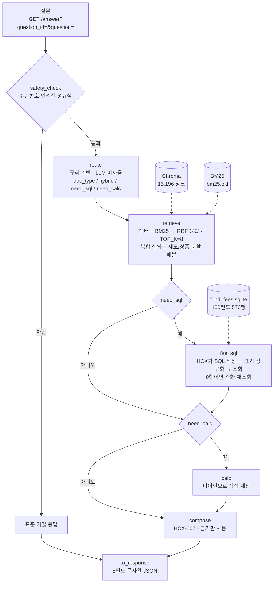
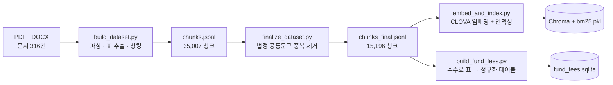

# 연금 Agent

미래에셋증권 AI Festival 출품작. **RAG 기반 연금 상담 시스템**입니다.
질문마다 필요한 노드만 골라 실행하는 파이프라인이며, **LLM 호출은 문항당 최대 2회**
(Text2SQL·답변 생성)입니다. 라우팅·계산·구간 판정은 LLM이 아니라 결정적 코드가 합니다.
투자설명서·제도 문서를 파싱해 검색 인덱스와 수수료 DB로 만들고, 질문이 들어오면
필요한 노드만 골라 실행해 **근거가 붙은 답변**을 돌려줍니다.

> 평가용 엔드포인트: **`http://211.188.59.247/answer`**
> 2026-09-01 배포, 09.07~09.20 평가 기간 무중단 운영 중입니다.

---

## 아키텍처 한눈에 보기



핵심은 **모든 질문이 같은 경로를 타지 않는다**는 것입니다. `route`가 질문을 읽고
수수료 조회(`fee_sql`)와 계산(`calc`)을 켤지 끌지 먼저 정하고, 켜진 노드만 실행합니다.
그래서 단순 제도 질문은 3개 노드로 끝나고, "총보수 얼마야" 같은 질문만 SQL을 탑니다.

**검색은 항상 실행합니다.** SQL 결과만으로는 출처를 달 수 없고, 수치 옆에 붙일
조건·예외·기준일이 문서 쪽에만 있기 때문입니다.

### 인덱스를 만드는 쪽 (오프라인, 1회성)



---

## 노드 구성 — 각 노드가 하는 일

`agent.py` 하나에 노드가 모여 있고, `run()`이 파이프라인을 **질문마다 다시 조립**합니다.

| 노드 | 하는 일 | 왜 이렇게 했는가 |
|---|---|---|
| **safety_check** | 주민등록번호·카드번호, 프롬프트 인젝션 패턴을 정규식으로 잡아 HCX 호출 전에 표준 거절 응답을 돌려준다 | 민감정보를 외부 API로 보내지 않기 위해서. LLM에게 "거절해라"라고 시키면 우회당한다 |
| **route** | 문서유형(제도/투자설명서)을 가르고, 수치 비교·정렬이면 `need_sql`, 연금수령한도 계산이면 `need_calc`를 켠다 | **LLM을 쓰지 않는다.** 라우팅까지 LLM에 맡기면 호출이 배로 늘고, 온도 때문에 같은 질문이 실행마다 다른 경로를 탄다 |
| **retrieve** | 벡터 검색(Chroma)과 키워드 검색(BM25)을 RRF로 합친다. 같은 계열 펀드를 비교하는 질문은 펀드별로 나눠 검색해 합친다 | 한 펀드가 상위를 독식해 나머지가 근거에서 빠지는 문제를 막는다. 검색은 온도가 없어 **실행마다 결과가 같다** |
| **fee_sql** | 자연어를 HCX-007로 SQL로 바꿔 `fund_fees.sqlite`를 조회한다. 생성된 SQL의 **표기 흔들림을 코드에서 흡수**한다 — 클래스·판매경로에 더해 **계좌유형 리터럴 이관·동의어 정규화**, 0행이면 **account_type 조건 낙하 재조회**까지 | 아래 별도 설명 |
| **calc** | 연금수령한도 `평가액/(11−연차)×120%` 같은 정해진 공식을 파이썬으로 계산한다 | LLM은 자릿수를 틀린다. 공식이 확정된 계산은 코드가 해야 한다 |
| **compose** | 근거 블록을 조립해 HCX-007로 최종 답변을 만든다 | 프롬프트 규칙 12개로 "근거 결론 뒤집지 않기 · 수치를 요약하지 않고 전부 옮기기 · 과장된 전제 수긍하지 않기 · 부족해도 답변을 포기하지 않기"를 강제한다 |
| **to_response** | 대회 규격 5필드 문자열 JSON으로 포장하고, `[근거 3]` 같은 참조를 `(doc55 1쪽)`으로 치환한다 | 채점이 출처 표기(locator)를 따로 본다 |

### fee_sql이 하는 진짜 일 — SQL 표기 정규화

LLM이 만든 SQL은 문법은 맞는데 **리터럴이 DB의 실제 값과 안 맞는** 경우가 대부분입니다.
이걸 프롬프트로 고치려다 실패하고, 결국 코드에서 흡수하는 쪽이 확실했습니다.

| 흔들림 | LLM이 쓴 것 | DB 실제 값 | 흡수 방법 |
|---|---|---|---|
| 클래스 표기 | `'Ae'`, `'A-e'` | `'A-E'` | 하이픈·대소문자 제거 후 비교 |
| 판매경로 | `'온라인직접판매'` | `'온라인'`, `'온라인슈퍼'` | 슈퍼 명시하면 정확일치, 아니면 `LIKE '온라인%'` |
| 펀드명 공백 | `'NH-Amundi하나로단기채'` | `'NH-Amundi 하나로 단기채 …'` | 양쪽 공백을 지우고 비교 |
| OR 묶음 | `A AND B OR C` | — | 괄호 강제 (연산자 우선순위 사고) |
| 집계 오용 | 비교 질문에 `MIN()` | — | 프롬프트에서 금지 + 파이썬 재정렬 |

0행이 나오면 펀드명을 `LIKE`로 완화해 **한 번 더 조회**합니다. 이때도 위 정규화를
전부 다시 태웁니다 — 하나라도 빠지면 조용히 엉뚱한 행을 잡습니다.

0행으로 끝나면 그 사실을 `compose`까지 전달합니다. 예전에는 조용히 넘어갔고,
그러면 LLM이 검색 근거의 표 조각에서 숫자처럼 생긴 걸 주워 왔습니다
(실제로 총보수를 `BL292`라고 답한 적이 있습니다).

---

## 파일 구성 — 각 파일이 하는 일

### 실행 계층

| 파일 | 하는 일 |
|---|---|
| `agent.py` | **본체.** 노드 전부 + 오케스트레이션 + HCX 클라이언트. 단독 실행도 됨 |
| `server.py` | `agent.run()`을 대회 규격 FastAPI로 감싼 평가 API. 기동 시 인덱스를 미리 로딩 |
| `search.py` | 하이브리드 검색 엔진. `agent.py`가 임포트해 쓰고, 단독 CLI로도 씀 |
| `deploy/DEPLOY.md` | NCP 배포 단계별 가이드 (서버 준비 → systemd → nginx → 외부 검증) |
| `deploy/nginx.conf` | 리버스 프록시. `proxy_read_timeout 320s`가 핵심 |
| `deploy/agent-server.service` | systemd 유닛. `Restart=always`로 무중단 |
| `requirements-lock.txt` | 서버 설치 기준 잠금 파일(`pip freeze`). 범위 지정인 `requirements.txt`와 달리 배포 서버는 이 파일로 설치해 로컬과 chromadb·numpy 버전을 정확히 일치시킴 |

### 데이터 파이프라인 (오프라인)

| 파일 | 하는 일 |
|---|---|
| `build_dataset.py` | PDF·DOCX → `chunks.jsonl`. 표는 마크다운으로 보존, 스캔본은 OCR |
| `finalize_dataset.py` | 법정 공통문구 중복 제거 → `chunks_final.jsonl` |
| `embed_and_index.py` | CLOVA 임베딩 → Chroma + BM25 인덱스 |
| `build_fund_fees.py` | 수수료 표 청크 → `fund_fees.sqlite` (펀드·클래스·판매경로·보수율) |

### 평가·진단

| 파일 | 하는 일 |
|---|---|
| `eval_answers.py` | 답변 채점 (팀 공용, 표준 라이브러리만). 어댑터/엔드포인트 양쪽 지원 |
| `score_official.py` | 팀 자체 배점 가정(A50/B20/C15/E15)으로 채점 + 실행 간 비교. 대회가 공지한 배점이 아니다 — 확인된 것은 슬라이드의 7개 평가지표 나열뿐 |
| `make_raw_from_gold.py` | 정답지에서 **질문만** 뽑아 실행. 문항마다 저장하고 `--resume` 지원 |
| `score_avg.py` | 같은 코드로 여러 번 돌린 결과의 평균·**오차범위**. 노이즈와 회귀를 가른다 |
| `run_eval.py` | 검색 계층만 측정 (하이브리드 / 벡터 / BM25 비교) |
| `diag_v4_retrieval.py` | 검색만 재는 결정적 진단. HCX를 안 불러 토큰이 거의 안 든다 |
| `verify_deploy_fix.py` | 배포 관련 수정(캐시 키·호출 간격·경로)을 HCX 없이 확인 |
| `token_report.py` | 실행 한 번이 쓴 입력/출력 토큰 집계 |

### 문서

| 파일 | 하는 일 |
|---|---|
| `기술제안서.md` | 제출용 기술 제안서 — 문제 정의 · 설계 근거 · 검증 체계 |
| `DATA_INTERFACE.md` | 청크 스키마와 `fund_fees` 스키마 정의 |

---

## 현재 성능

생성 변동 때문에 단일 회차 수치를 쓰지 않고 **다회 측정의 범위와 중앙값**으로
적습니다(기술제안서 7절과 같은 출처·같은 규칙).

| 평가셋 | 문항 | 회차 | 결과 | 측정일 |
|---|---:|---|---|---|
| `gold_holdout_v4` (가중 종합) | 24 | **2회**(최종 코드) | **82.6~85.5%** — freeze 74.9%(같은 셋 · 1회 · 09-01) 대비 개선. 직전 코드 계열 6회는 82.6~85.6% | 2026-09-03 |
| `evalset_v1` 정답률/근거 제공률 | 40 | 2회(최종 코드) | 87.5~92.5% / 97.5% | 2026-09-03 |
| `evalset_v2` | 22 | 1회 | 86.4% / 100.0% | 2026-09-02 |
| `evalset_v4_stress_36` | 36 | 1회 | 80.6% / 80.6% | 2026-08-31 |
| `evalset_ext30` | 30 | 1회 | 90.0% / 73.3% | 2026-08-31 |
| 배포 API (외부, v1 40문항) | 40 | 6회 | 77.5~92.5% / 95.0~97.5% (**최종 92.5% / 97.5%**, 응답 평균 7.3초·최대 21.2초) | 2026-09-03 |

`evalset_v2`는 26문항 중 `coverage=none` 4문항을 뺀 22문항 기준입니다.
홀드아웃 축별 수치와 회차별 원시 파일 경로는 기술제안서 7.2절에 있습니다.

**공정성 표기 원칙** — 정답지를 연 뒤에 튜닝한 값은 freeze 값과 **항상 같이** 적습니다.
팀 blind **공식 v4**(30문항 · strict 채점 · 08월)는 freeze **66.7%** / post-tune **80.0%** 입니다.
위 표의 홀드아웃(`gold_holdout_v4` · 24문항)과는 **별개 평가셋**이라 freeze 74.9%와 수치가 다릅니다.

**근거 제공률**은 "근거를 붙였나"가 아니라 *정답 핵심어가 `retrieved_context`에 실제로
들어왔나*를 봅니다(`eval_answers.py`의 `miss_c`). 그래서 근거 제공률이 정답률보다
높으면 **검색은 됐는데 생성이 그 근거를 못 쓴 것**이라고 읽습니다.

측정할 때마다 값이 흔들리는 이유는 **검색이 아니라 생성** 쪽입니다. 검색은 임베딩+BM25라
온도가 없어 결정적이고, 실제로 여러 번 돌려도 C(출처) 점수가 소수점까지 동일합니다.
그래서 회귀를 판단할 때는 `score_avg.py`로 오차범위를 먼저 잡고 비교합니다.

### 데이터 규모

| | 수량 |
|---|---|
| 원본 문서 | 316건 (OK 314 / LOW_YIELD 2) |
| 청크 (중복 제거 전) | 35,007 |
| 청크 (인덱싱 대상) | 15,196 — 투자설명서 14,273 / 연금문서 760 / 기타 163 |
| `fund_fees` | 100펀드 576행 |

---

## 빠른 시작

```bash
python -m venv venv && source venv/bin/activate
pip install -r requirements.txt
cp .env.example .env
```

`.env`에 CLOVA Studio 키를 넣습니다. **`.env`는 `agent.py`와 같은 폴더에** 두세요
(파일 위치 기준으로 읽습니다).

```bash
python agent.py "퇴직연금 중도인출 사유가 뭐야?"
python agent.py "총보수 싼 연금저축 펀드 알려줘" --show-evidence
python agent.py --selftest
```

서버로 띄우려면:

```bash
uvicorn server:app --host 127.0.0.1 --port 8000
```

```bash
curl "http://127.0.0.1:8000/answer?question_id=t1&question=DC%EC%99%80%20DB%EC%9D%98%20%EC%B0%A8%EC%9D%B4"
```

> zsh에서는 `#` 주석이 인식되지 않아 명령 인자로 넘어갑니다.
> 이 문서의 명령은 전부 주석 없이 적어두었습니다.

---

# 파이프라인 상세

## 1단계: 문서 → 청크 (`build_dataset.py`)

PDF·DOCX 문서를 **RAG 검색용 JSONL**로 변환합니다.

### 왜 txt/엑셀이 아니라 JSONL인가

| | 통합 txt | 엑셀 | **JSONL** |
|---|---|---|---|
| 출처(펀드코드·페이지) 추적 | ✗ | △ | ✓ |
| 수천 자 본문 안전 저장 | ✓ | ✗ (셀 제한·줄바꿈 깨짐) | ✓ |
| 표 구조 보존 | ✗ | △ | ✓ (마크다운) |
| 스트리밍 처리 / 증분 추가 | △ | ✗ | ✓ |
| 벡터 DB 적재 | 재가공 필요 | 재가공 필요 | 바로 가능 |

연금·펀드 도메인에서는 "이 수수료율이 **어느 펀드 몇 페이지**에서 나왔는지"를 답변에
달 수 있어야 합니다. 통합 txt는 그 정보를 구조적으로 잃어버립니다.

### 실행

먼저 5개만 돌려 결과를 눈으로 확인합니다.

```bash
python build_dataset.py --input . --out ./dataset --limit 5
```

괜찮으면 전체를 돌립니다.

```bash
python build_dataset.py --input . --out ./dataset --workers 4
```

중단됐다면 같은 명령을 다시 실행하세요 — 끝난 문서는 자동으로 건너뜁니다.
추출 로직을 고쳤다면 `--force`를 붙입니다.

### chunks.jsonl 스키마

```json
{
  "chunk_id":    "KR5157450090_p23_0071",
  "doc_id":      "KR5157450090",
  "doc_type":    "투자설명서",
  "fund_code":   "KR5157450090",
  "fund_name":   "마이다스 거북이 90 증권 자투자신탁 1호(주식)",
  "kofia_code":  null,
  "base_date":   "2025-10-01",
  "page":        23,
  "section":     "(2) 종류별 수수료 및 보수에 관한 사항",
  "content_type":"table",
  "is_ocr":      false,
  "text":        "| 구분 | 선취 판매수수료 | ... |",
  "n_chars":     742,
  "source_path": "투자설명서/KR5157450090/R2_KR5157450090.pdf"
}
```

`content_type: "table"`인 청크는 마크다운 표입니다. 수수료율·보수율·세율처럼
**행과 열의 대응이 의미인 데이터**가 여기 들어갑니다. 임베딩 시 잘라내지 마세요.

### manifest.csv 읽는 법

`status` 열만 보면 됩니다.

| status | 의미 | 조치 |
|---|---|---|
| `OK` | 정상 | — |
| `NEEDS_OCR` | 텍스트 레이어 없음 = 스캔 PDF | `.env`에 OCR 키 넣고 재실행 |
| `LOW_YIELD` | 페이지 대비 추출량이 적음 | 해당 문서 육안 확인 |
| `ERROR` | 파싱 실패 | `error` 열 확인 |

`fund_name` / `base_date`가 빈 투자설명서가 있다면 운용사별 서식 차이입니다.
`build_dataset.py`의 `RE_FUND_NAME`, `RE_BASE_DATE`에 패턴을 추가하세요.

## 2단계: 임베딩 전 정리 (`finalize_dataset.py`)

```bash
python finalize_dataset.py --in ./dataset/chunks.jsonl \
                           --out ./dataset/chunks_final.jsonl \
                           --exclude ncp_data_test
```

투자설명서 100개는 자본시장법이 요구하는 **동일한 법정 문구**를 공유합니다
(수익자총회·손해배상책임·투자신탁 해지 등). 그대로 임베딩하면 —

- 같은 문장을 최대 24번 임베딩 → 비용 낭비
- "수익자총회가 뭐야?"에 **똑같은 청크 24개**가 상위를 채움 → 검색 품질 붕괴

완전히 동일한 청크는 하나만 남기고 `doc_ids`에 공유 문서를 기록합니다.

```json
{ "chunk_id":"COMMON_a3f9…", "scope":"공통", "n_docs":24,
  "doc_ids":["KR5109…","KR5113…"],
  "fund_code":null, "fund_name":null }
```

`scope: "공통"` 청크는 `fund_code`가 `null`입니다. 특정 펀드의 것이 아니기 때문에
임의로 하나를 골라 붙이면 **잘못된 출처를 답변에 달게 됩니다.**

> ⚠️ **유사 중복은 병합하지 않습니다.** 숫자만 다른 두 청크는
> "같은 서식의 다른 수수료율"일 수 있습니다. 0.72%와 1.30%를 하나로 합치는
> 순간 데이터셋이 거짓말을 시작합니다. 완전 일치만 병합합니다.

## 3단계: 임베딩 + 인덱싱 (`embed_and_index.py`)

**0단계 — API 없이 파이프라인만 점검**

```bash
python embed_and_index.py --provider dummy --limit 200
```

**1단계 — API 계약 확인.** 호출 1회로 응답 구조와 차원 수를 봅니다.

```bash
python embed_and_index.py --selftest
```

**2단계 — 소량 검증 후 전체**

```bash
python embed_and_index.py --limit 300
```

```bash
python embed_and_index.py --workers 8
```

`--selftest`를 **반드시 먼저** 돌리세요. 1만 건을 다 돌린 뒤에 응답 형식이
틀린 걸 아는 건 최악입니다. CLOVA Studio 임베딩 엔드포인트는 테스트 앱/서비스 앱에 따라
경로가 다르고 인증 헤더 방식도 두 가지라 `.env`에서 맞춰야 합니다.

```ini
CLOVA_API_KEY=nv-....................
CLOVA_EMBED_URL=https://clovastudio.stream.ntruss.com/v1/api-tools/embedding/v2
CLOVA_EMBED_AUTH=bearer
CLOVA_APIGW_KEY=
```

`CLOVA_EMBED_AUTH`는 `bearer`로 안 되면 `ncp`로 바꾸세요.
임베딩 결과는 `dataset/emb_cache.sqlite`에 `text_hash`로 캐싱됩니다 —
**API 비용을 두 번 내지 않기 위한 장치**입니다.

## 4단계: 하이브리드 검색 (`search.py`)

```bash
python search.py "퇴직연금 중도인출 사유가 뭐야?"
python search.py "판매보수 얼마야" --fund KR5157450090
python search.py "위험등급" --type table -k 10
python search.py "중도인출" --json
```

벡터 검색(Chroma)과 키워드 검색(BM25)을 RRF로 합칩니다. 연금 질의는 두 종류가 섞여 있어서요.

| 질의 | 강한 쪽 |
|---|---|
| "중도인출하면 세금 얼마나 떼?" | 벡터 (의미) |
| "종류C-P2 판매보수 알려줘" | BM25 (고유명사·코드) |

`종류C-P2`, `KR5157450090` 같은 코드는 임베딩 공간에서 서로 뭉쳐버려 벡터 검색만으로는
정확한 하나를 못 집습니다. BM25는 반대로 정확히 그걸 집습니다.

주요 상수: `RRF_K=60`, `POOL=60`(검색기당 후보 수), `TOP_K=8`,
`EVIDENCE_CHARS=1500`(청크당 프롬프트 투입 상한), `MAX_CONTEXT_CHARS=9000`.

## 5단계: 평가

```bash
python eval_answers.py --adapter agent:answer_for_eval --evalset evalset_v1.json --show
```

```bash
python make_raw_from_gold.py --gold {정답지경로} --out raw_run1.json --resume
python score_official.py --raw raw_run1.json --compare raw_이전실행.json
```

`--compare`를 붙이면 문항별로 좋아진 것/나빠진 것을 갈라 보여줍니다.
회귀인지 노이즈인지 판단하려면 `score_avg.py`로 **같은 코드 반복 실행의 오차범위**를
먼저 잡으세요. 그 범위 안의 변화는 회귀가 아닙니다.

## 6단계: 평가 API 서버 (`server.py`, `deploy/`)

```
GET /answer?question_id={id}&question={질의}
→ {question_id, question, retrieved_context, think_trace, answer}   (전부 문자열)
```

- 기동 시 `agent.warmup()`으로 인덱스(BM25 72MB + Chroma)를 미리 로딩한다 —
  그래야 첫 요청이 20초쯤 손해보지 않는다.
- `/answer` 처리 중 예외가 나도 5xx를 흘려보내지 않고 규격에 맞는 5필드 JSON으로
  응답한다. 평가 API는 5xx보다 "형식은 맞지만 내용이 빈 답"이 재시도 낭비가 적다.
- `/health`는 우리가 생존 확인용으로만 쓰는 엔드포인트 — 평가 규격에는 없다.

배포 시 서버로 옮겨야 할 데이터는 **4개뿐**입니다 (약 391MB).
`chroma/`, `bm25.pkl`, `chunks_final.jsonl`, `fund_fees.sqlite`.
`docs/`, `chunks.jsonl`, `emb_cache.sqlite`는 인덱스를 만들 때만 쓰므로 안 옮겨도 됩니다.
자세한 절차는 `deploy/DEPLOY.md`에 있습니다.

## 튜닝 포인트

`build_dataset.py` 상단 상수만 바꾸면 됩니다.

```python
CHUNK_TARGET   = 900
CHUNK_OVERLAP  = 150
TABLE_SETTINGS = {...}
HEADING_PATTERNS = [...]
```

## 방침

**파인튜닝은 하지 않습니다.** 문서 사실을 가중치에 넣지 않고 RAG로 근거를 줍니다.
대회 규정상 답변 생성 LLM은 HyperCLOVA 계열이어야 합니다.
