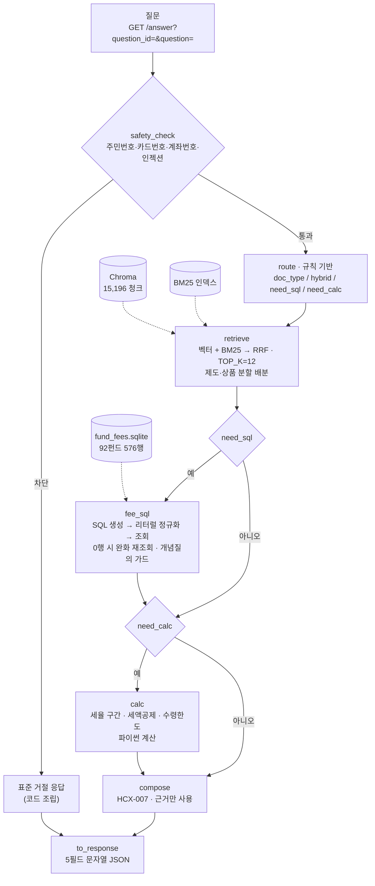
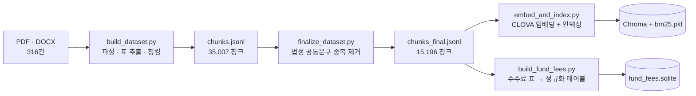

# 연금 Agent

제10회 미래에셋증권 AI Festival 출품작. 투자설명서와 연금 제도 문서를 근거로 연금 상담 질의에 답하는 RAG 시스템입니다.

평가용 엔드포인트: `http://211.188.59.247/answer`
운영 기간: 2026-09-07 ~ 09-20
심사 대상 코드 커밋: `7093b33` (배포 서버가 이 해시로 동작합니다. 이후 커밋은 문서 전용입니다)

---

## 설계 요약

연금 질의는 한 종류가 아닙니다. "DB와 DC의 차이"는 제도 문서를 읽으면 되고, "A-e 클래스 총보수"는 수수료 표를 조회해야 하며, "연금수령한도"는 공식에 숫자를 넣어야 합니다. 셋을 같은 경로로 처리하면 쉬운 질문에는 낭비가, 어려운 질문에는 오답이 생깁니다.

그래서 두 가지를 정했습니다.

**질문마다 파이프라인을 다시 조립합니다.** 규칙 기반 `route` 노드가 실행할 노드를 먼저 결정합니다. 제도 질문은 세 노드로 끝나고, 수수료 질문만 Text2SQL을 타고, 계산 질문만 계산 노드를 탑니다. 라우팅에 LLM을 쓰지 않으므로 같은 질문은 항상 같은 경로를 탑니다.

**LLM이 흔들리는 자리는 코드로 옮겼습니다.** 라우팅, 검색, 안전성 판정, 세율 구간 판정, 세액공제 계산이 모두 결정적 파이썬입니다. LLM 호출은 문항당 최대 2회(Text2SQL, 답변 생성)이며 전 구간 HyperCLOVA X(HCX-007)입니다.

---

## 아키텍처



검색은 모든 질문에서 실행합니다. SQL 결과만으로는 출처를 달 수 없고, 수치 옆에 붙일 조건·예외·기준일이 문서 쪽에만 있기 때문입니다.

### 인덱스 구축 (오프라인, 1회성)



---

## 노드

`agent.py` 한 파일에 노드가 모여 있고 `run()`이 질문마다 파이프라인을 조립합니다.

| 노드 | 하는 일 | 설계 이유 |
|---|---|---|
| `safety_check` | 주민등록번호·카드번호·계좌번호와 프롬프트 인젝션 패턴을 정규식으로 잡아 HCX 호출 전에 표준 거절을 반환 | 민감정보를 외부 API로 보내지 않기 위해서. LLM에게 거절을 시키면 우회당한다 |
| `route` | 제도·상품 키워드 수를 세어 문서 유형을 가르고, 수치 비교면 `need_sql`, 확정 공식이면 `need_calc`를 켠다 | 라우팅을 LLM에 맡기면 호출이 배로 늘고 같은 질문이 실행마다 다른 경로를 탄다 |
| `retrieve` | 벡터(Chroma)와 BM25를 RRF로 융합. 제도·상품 질의는 자리를 나눠 배분 | 한쪽 문서군이 상위를 독식해 나머지가 근거에서 빠지는 문제를 막는다 |
| `fee_sql` | HCX가 만든 SQL의 리터럴을 코드가 교정한 뒤 `fund_fees`를 조회 | 아래 별도 설명 |
| `calc` | 세율 구간 판정, 세액공제액, 연금수령한도를 파이썬으로 계산 | LLM은 자릿수를 틀린다. `평가액/(11−연차)×120%`를 `×(11−연차)`로 계산해 8배 오류를 낸 사례가 있다 |
| `compose` | 근거 블록을 조립해 HCX-007로 답변 생성 | 근거 밖 내용 생성 금지를 프롬프트 규칙으로 고정 |
| `to_response` | 대회 규격 5필드 문자열 JSON으로 포장하고 `[근거 3]` 같은 참조를 문서명·쪽수로 치환 | 채점이 출처 표기를 따로 본다 |

### fee_sql — SQL 생성이 아니라 SQL 교정

LLM이 만든 SQL은 문법은 맞는데 리터럴이 DB의 실제 값과 어긋나는 경우가 대부분입니다. 프롬프트로 고치려다 실패했고, 생성된 SQL을 실행 전에 코드가 다시 쓰는 계층을 만들었습니다.

| 흔들림 | LLM이 쓴 것 | DB 실제 값 | 교정 |
|---|---|---|---|
| 클래스 표기 | `'Ae'`, `'A-e'` | `'A-E'` | 하이픈·대소문자 제거 후 비교 |
| 판매경로 | `'온라인직접판매'` | `'온라인'`, `'온라인슈퍼'` | 슈퍼 명시 시 정확일치, 아니면 `LIKE '온라인%'` |
| 펀드명 공백 | `'NH-Amundi하나로단기채'` | `'NH-Amundi 하나로 단기채 …'` | 공백 제거 후 비교 |
| 펀드명 태그 | `'%스팍스한국엄선투자[주식]%'` | `'스팍스한국엄선투자증권자투자신탁[주식]'` | 자산군 태그·법적 명칭을 떼고 재조회 |
| 근거 없는 클래스 | 질문에 없는 `class_code='C-P'` | — | 클래스 신호가 없으면 조건 제거 |
| 연산자 우선순위 | `A AND B OR C` | — | 괄호 강제 |
| 집계 오용 | 비교 질문에 `MIN()` | — | 프롬프트 금지 + 파이썬 재정렬 |
| 계좌유형 혼입 | `class_code IN ('개인연금')` | `account_type = '연금저축'` | 완전일치일 때만 조건 이관 |

펀드명 태그 교정에는 안전장치를 붙였습니다. 태그를 떼고 조회한 결과가 **둘 이상의 서로 다른 펀드에 걸치면 채택하지 않습니다.** 사용자가 특정 펀드 하나를 지목했으므로 여러 펀드에 걸친 매치는 성공이 아니라 모호한 매치입니다.

조회가 끝내 0행이면 그 사실을 `compose`까지 전달하고, **질문이 지목하지 않은 펀드의 수수료를 답변에 넣지 못하게 막습니다.** 예전에는 0행을 조용히 넘겼고, 그러면 모델이 검색 근거의 표 조각에서 숫자처럼 생긴 것을 주워 왔습니다. 실제로 총보수를 `BL292`라고 답한 적이 있고, 데이터가 DB에 있는데도 "확인되지 않습니다"라고 답하면서 무관한 펀드 아홉 개를 나열한 적이 있습니다.

반대 방향의 가드도 있습니다. 펀드를 특정하지 않은 전체 조회인데 비교·정렬·집계 신호가 없으면, 그 SQL 결과를 `compose`에 넘기지 않습니다. 개념을 묻는 질문에 50행짜리 표를 던지면 모델이 표에 끌려가 자기 설명과 반대되는 결론을 냅니다. 실측으로 확인한 현상이고, 표를 빼면 결론이 바로잡힙니다.

### 검색 자리 배분

`TOP_K=12`를 제도·상품에 나눠 배분합니다. 배분 비율은 질문 유형이 정합니다.

| 조건 | 제도 | 상품 |
|---|---:|---:|
| 상품 키워드 > 제도 키워드 | 2 | 10 |
| `need_sql` 또는 세법 조문 또는 상품 키워드 0 | 10 | 2 |
| 그 외 | 6 | 6 |

제도 키워드가 하나뿐인 질문도 분할을 켭니다. 켜지 않으면 코퍼스 비중이 큰 투자설명서 청크가 열두 자리를 모두 차지합니다. 세액공제 한도를 묻는 질문에서 정답 근거인 제도 문서가 한 건도 검색되지 않던 원인이 이것이었습니다.

제도 문서를 검색할 때는 펀드코드 필터를 걸지 않습니다. 제도 문서에는 펀드코드가 없으므로, 필터를 걸면 결과가 구조적으로 0건이 되고 분할이 조용히 무산됩니다.

---

## 성능

생성 변동 때문에 단일 회차 수치를 쓰지 않습니다. 다회 측정의 범위와 중앙값으로 적고, 회차 수와 측정 시점 코드를 함께 밝힙니다.

### 자체 평가셋 — 09-03 코드(`e814548`) 기준

| 평가셋 | 문항 | 회차 | 결과 |
|---|---:|---|---|
| `gold_holdout_v4` (가중 종합) | 24 | 4회 | 82.3~84.7% (중앙값 83.9%) |
| `evalset_v1` 정답률 / 근거 제공률 | 40 | 2회 | 92.5~95.0% / 97.5% |
| `evalset_v2` (22 유효) | 22 | 1회 | 90.9% / 100.0% |
| `evalset_ext30` | 30 | 1회 | 93.3% / 86.7% |
| `evalset_v4_stress_36` | 36 | 1회 | 80.6% / 83.3% |
| 배포 API (외부, v1) | 40 | 6회 | 77.5~92.5% / 95.0~97.5% |

`gold_holdout_v4` freeze 값은 74.9%(1회, 09-01)입니다. 팀 blind 공식 v4(30문항, strict, 08월)는 freeze 66.7% / post-tune 80.0%로, 위 홀드아웃과는 별개 평가셋입니다.

### `4c47d5b` 기준

| 측정 | 회차 | 결과 |
|---|---|---|
| `gold_holdout_v4` 가중 종합 | 1회 | 80.9% (정확도 71.5 / 검색 91.5 / 출처 80.8 / 정합성 98.2) |

단일 회차이므로 범위를 주장하지 않습니다. 09-03 같은 날 실행들이 74.0~85.6%로 흩어져 있어, 1회 값만으로는 변동과 회귀를 가를 수 없습니다.

### 3차 감사 — `4c47d5b` 기준

평가셋과 별개로, 50문항 감사셋과 28문항 화이트박스 진단셋으로 세 차례 감사했습니다. 답변을 사람이 직접 읽고 심각도를 매기는 방식입니다.

| | 치명 | 중대 | 경미 |
|---|---:|---:|---:|
| 1회차 (09-03) | 3 | 3 | 8 |
| 2회차 (09-03 재실행) | 3 | 5 | 8 |
| 3회차 (09-04, `4c47d5b`) | 0 | 1 | 6 |

치명 세 건은 세액공제 한도 오답, 결론과 근거의 모순, 실존 데이터를 "확인되지 않음"으로 답한 사례였습니다. 각각의 원인과 대응은 기술제안서 7절에 있습니다.

### 근거 제공률의 정의

"근거를 붙였나"가 아니라 정답 핵심어가 `retrieved_context`에 실제로 들어왔는지를 봅니다. 그래서 근거 제공률이 정답률보다 높으면 검색은 됐는데 생성이 그 근거를 쓰지 못한 것으로 읽습니다.

측정값이 흔들리는 쪽은 검색이 아니라 생성입니다. 검색은 임베딩과 BM25라 온도가 없어 결정적이고, 여러 번 돌려도 출처 점수가 소수점까지 같습니다. 회귀를 판단할 때는 `score_avg.py`로 오차범위를 먼저 잡고 비교합니다.

### 데이터 규모

| | 수량 |
|---|---|
| 원본 문서 | 316건 (OK 314 / LOW_YIELD 2) |
| 청크 (중복 제거 전) | 35,007 |
| 청크 (인덱싱 대상) | 15,196 — 투자설명서 14,273 / 연금문서 760 / 기타 163 |
| `fund_fees` | 92펀드 576행 |

---

# 개발자 안내

## 빠른 시작

```bash
python -m venv venv && source venv/bin/activate
pip install -r requirements.txt
cp .env.example .env
```

`.env`에 CLOVA Studio 키를 넣습니다. `.env`는 `agent.py`와 같은 폴더에 두세요. 파일 위치를 기준으로 읽습니다.

### 데이터셋 만들기

`dataset/` 산출물은 용량 때문에 저장소에 없지만 **원본 문서는 함께 올라가 있습니다**(`0.투자설명서 복사본` 100파일, `0.docs_renamed 복사본` 58파일). 저장소만 클론해도 아래 순서로 다시 만들 수 있습니다.

```bash
python build_dataset.py --input . --out ./dataset --workers 4
python finalize_dataset.py --in ./dataset/chunks.jsonl --out ./dataset/chunks_final.jsonl
python embed_and_index.py --selftest
python embed_and_index.py --workers 8
python build_fund_fees.py
```

임베딩 단계에서 CLOVA API 호출이 발생하고 문서 수만큼 시간이 걸립니다. `--selftest`로 응답 규격을 먼저 확인한 뒤 전체를 돌리세요. 결과는 `dataset/emb_cache.sqlite`에 캐싱되어 재실행 시 다시 호출하지 않습니다.

```bash
python agent.py "퇴직연금 중도인출 사유가 뭐야?"
python agent.py "총보수 싼 연금저축 펀드 알려줘" --show-evidence
python agent.py --selftest
```

서버 실행:

```bash
uvicorn server:app --host 127.0.0.1 --port 8000
curl "http://127.0.0.1:8000/answer?question_id=t1&question=DC%EC%99%80%20DB%EC%9D%98%20%EC%B0%A8%EC%9D%B4"
```

Docker로 실행하려면:

```bash
docker build -t pension-agent .
docker run --rm -p 8000:8000 --env-file .env pension-agent
curl localhost:8000/health
```

빌드에는 위에서 만든 `dataset/` 산출물 네 개가 있어야 합니다. `.env`는 이미지에 담지 않고 `--env-file`로 주입합니다.

zsh에서는 `#`가 주석으로 처리되지 않아 명령 인자로 넘어갑니다. 이 문서의 명령은 전부 주석 없이 적었습니다.

## 파일 구성

### 실행 계층

| 파일 | 역할 |
|---|---|
| `agent.py` | 본체. 노드 전부와 오케스트레이션, HCX 클라이언트. 단독 실행 가능 |
| `server.py` | `agent.run()`을 대회 규격 FastAPI로 감싼 평가 API. 기동 시 인덱스 사전 로딩 |
| `search.py` | 하이브리드 검색 엔진. `agent.py`가 임포트하며 단독 CLI로도 사용 |
| `deploy/DEPLOY.md` | NCP 배포 가이드 (서버 준비 → systemd → nginx → 외부 검증) |
| `deploy/nginx.conf` | 리버스 프록시. `proxy_read_timeout 320s` |
| `deploy/agent-server.service` | systemd 유닛. `Restart=always` |
| `requirements-lock.txt` | 배포 서버 설치 기준. 범위 지정인 `requirements.txt`와 달리 chromadb·numpy 버전을 로컬과 정확히 맞춘다 |

### 데이터 파이프라인

| 파일 | 역할 |
|---|---|
| `build_dataset.py` | PDF·DOCX → `chunks.jsonl`. 표는 마크다운으로 보존, 스캔본은 OCR |
| `finalize_dataset.py` | 법정 공통문구 중복 제거 → `chunks_final.jsonl` |
| `embed_and_index.py` | CLOVA 임베딩 → Chroma + BM25 |
| `build_fund_fees.py` | 수수료 표 청크 → `fund_fees.sqlite` |

### 평가·진단

| 파일 | 역할 |
|---|---|
| `eval_answers.py` | 답변 채점. 표준 라이브러리만 사용. 어댑터·엔드포인트 양쪽 지원 |
| `score_official.py` | 팀 자체 배점 가정으로 채점 + 실행 간 비교. 대회 공지 배점이 아니다 |
| `score_avg.py` | 반복 실행의 평균과 오차범위. 노이즈와 회귀를 가른다 |
| `make_raw_from_gold.py` | 정답지에서 질문만 뽑아 실행. `--resume` 지원 |
| `run_eval.py` | 검색 계층만 측정 (하이브리드 / 벡터 / BM25) |
| `diag_v4_retrieval.py` | 검색만 재는 결정적 진단. HCX를 호출하지 않는다 |
| `token_report.py` | 실행 한 번의 입력·출력 토큰 집계 |

### 문서

| 파일 | 역할 |
|---|---|
| `기술제안서.md` | 제출용 기술 제안서 |
| `DATA_INTERFACE.md` | 청크 스키마와 `fund_fees` 스키마 |

---

## 파이프라인 상세

### 1단계 — 문서를 청크로 (`build_dataset.py`)

PDF·DOCX를 검색용 JSONL로 변환합니다.

통합 txt나 엑셀이 아닌 이유는 출처 추적입니다. 연금·펀드 도메인에서는 "이 수수료율이 어느 펀드 몇 페이지에서 나왔는지"를 답변에 달 수 있어야 하는데, 통합 txt는 그 정보를 구조적으로 잃습니다. 엑셀은 셀 길이 제한과 줄바꿈 깨짐으로 수천 자 본문을 안전하게 담지 못합니다.

```bash
python build_dataset.py --input . --out ./dataset --limit 5     # 먼저 5개만
python build_dataset.py --input . --out ./dataset --workers 4   # 전체
```

중단됐다면 같은 명령을 다시 실행하세요. 끝난 문서는 건너뜁니다. 추출 로직을 고쳤다면 `--force`를 붙입니다.

청크 스키마:

```json
{
  "chunk_id":    "KR5157450090_p23_0071",
  "doc_id":      "KR5157450090",
  "doc_type":    "투자설명서",
  "fund_code":   "KR5157450090",
  "fund_name":   "마이다스 거북이 90 증권 자투자신탁 1호(주식)",
  "base_date":   "2025-10-01",
  "page":        23,
  "section":     "(2) 종류별 수수료 및 보수에 관한 사항",
  "content_type":"table",
  "is_ocr":      false,
  "text":        "| 구분 | 선취 판매수수료 | ... |",
  "n_chars":     742,
  "source_path": "투자설명서/KR5157450090/R2_KR5157450090.pdf"
}
```

`content_type: "table"`은 마크다운 표입니다. 수수료율·세율처럼 행과 열의 대응이 의미인 데이터가 여기 들어갑니다. 임베딩할 때 잘라내지 마세요.

`manifest.csv`는 `status` 열만 보면 됩니다.

| status | 의미 | 조치 |
|---|---|---|
| `OK` | 정상 | — |
| `NEEDS_OCR` | 텍스트 레이어 없음 | `.env`에 OCR 키를 넣고 재실행 |
| `LOW_YIELD` | 페이지 대비 추출량 부족 | 해당 문서 육안 확인 |
| `ERROR` | 파싱 실패 | `error` 열 확인 |

`fund_name`이나 `base_date`가 빈 투자설명서는 운용사별 서식 차이입니다. `build_dataset.py`의 `RE_FUND_NAME`, `RE_BASE_DATE`에 패턴을 추가하세요.

### 2단계 — 중복 제거 (`finalize_dataset.py`)

```bash
python finalize_dataset.py --in ./dataset/chunks.jsonl \
                           --out ./dataset/chunks_final.jsonl \
                           --exclude ncp_data_test
```

투자설명서 100개는 자본시장법이 요구하는 동일한 법정 문구를 공유합니다. 그대로 임베딩하면 같은 문장을 최대 24번 임베딩하게 되고, "수익자총회가 뭐야?"라는 질문에 똑같은 청크 24개가 상위를 채웁니다.

완전히 동일한 청크는 하나만 남기고 `doc_ids`에 공유 문서를 기록합니다.

```json
{ "chunk_id":"COMMON_a3f9…", "scope":"공통", "n_docs":24,
  "doc_ids":["KR5109…","KR5113…"], "fund_code":null, "fund_name":null }
```

`scope: "공통"` 청크는 `fund_code`가 `null`입니다. 특정 펀드의 것이 아니므로 임의로 하나를 골라 붙이면 잘못된 출처를 답변에 달게 됩니다.

유사 중복은 병합하지 않습니다. 숫자만 다른 두 청크는 같은 서식의 다른 수수료율일 수 있습니다. 0.72%와 1.30%를 하나로 합치는 순간 데이터셋이 거짓말을 시작합니다.

### 3단계 — 임베딩과 인덱싱 (`embed_and_index.py`)

```bash
python embed_and_index.py --provider dummy --limit 200   # API 없이 파이프라인 점검
python embed_and_index.py --selftest                     # API 계약 확인 (호출 1회)
python embed_and_index.py --limit 300                    # 소량 검증
python embed_and_index.py --workers 8                    # 전체
```

`--selftest`를 반드시 먼저 돌리세요. 1만 건을 다 돌린 뒤에 응답 형식이 틀린 걸 아는 건 최악입니다. CLOVA Studio 임베딩 엔드포인트는 테스트 앱과 서비스 앱의 경로가 다르고 인증 헤더도 두 가지라 `.env`에서 맞춰야 합니다.

```ini
CLOVA_API_KEY=nv-....................
CLOVA_EMBED_URL=https://clovastudio.stream.ntruss.com/v1/api-tools/embedding/v2
CLOVA_EMBED_AUTH=bearer
CLOVA_APIGW_KEY=
```

`CLOVA_EMBED_AUTH`는 `bearer`로 안 되면 `ncp`로 바꾸세요. 임베딩 결과는 `dataset/emb_cache.sqlite`에 `text_hash`로 캐싱되어 같은 텍스트에 두 번 비용을 내지 않습니다.

### 4단계 — 하이브리드 검색 (`search.py`)

```bash
python search.py "퇴직연금 중도인출 사유가 뭐야?"
python search.py "판매보수 얼마야" --fund KR5157450090
python search.py "위험등급" --type table -k 10
python search.py "중도인출" --json
```

연금 질의는 두 종류가 섞여 있습니다.

| 질의 | 강한 쪽 |
|---|---|
| "중도인출하면 세금 얼마나 떼?" | 벡터 (의미) |
| "종류C-P2 판매보수 알려줘" | BM25 (고유명사·코드) |

`종류C-P2`나 `KR5157450090` 같은 코드는 임베딩 공간에서 서로 뭉쳐 벡터 검색만으로는 정확한 하나를 집지 못합니다. BM25는 반대로 정확히 그것을 집습니다.

주요 상수: `RRF_K=60`, `POOL=60`, `TOP_K=12`, `EVIDENCE_CHARS=1500`, `MAX_CONTEXT_CHARS=9000`.

### 5단계 — 평가

```bash
python eval_answers.py --adapter agent:answer_for_eval --evalset evalset_v1.json --show
python make_raw_from_gold.py --gold {정답지경로} --out raw_run1.json --resume
python score_official.py --raw raw_run1.json --compare raw_이전실행.json
```

`--compare`는 문항별로 좋아진 것과 나빠진 것을 갈라 보여줍니다. 회귀인지 노이즈인지 판단하려면 `score_avg.py`로 같은 코드 반복 실행의 오차범위를 먼저 잡으세요. 그 범위 안의 변화는 회귀가 아닙니다.

### 6단계 — 평가 API (`server.py`, `deploy/`)

```
GET /answer?question_id={id}&question={질의}
→ {question_id, question, retrieved_context, think_trace, answer}
```

다섯 필드는 모두 문자열입니다. 상세 명세는 `API.md`에 있습니다.

- 기동 시 `agent.warmup()`으로 BM25(72MB)와 Chroma를 미리 로딩합니다. 그래야 첫 요청이 20초쯤 손해보지 않습니다.
- `/answer` 처리 중 예외가 나도 5xx를 흘리지 않고 규격에 맞는 5필드 JSON으로 응답합니다. 평가 API에서는 5xx보다 형식이 맞는 빈 답이 재시도 낭비가 적습니다.
- `/health`는 생존 확인용이며 평가 규격에는 없습니다.

실제 채점은 배포 API(`http://211.188.59.247/answer`)로 이루어집니다. Docker 이미지는 로컬 재현·검증용입니다.

배포 시 서버로 옮길 데이터는 네 개입니다(약 391MB). `chroma/`, `bm25.pkl`, `chunks_final.jsonl`, `fund_fees.sqlite`. `docs/`, `chunks.jsonl`, `emb_cache.sqlite`는 인덱스를 만들 때만 쓰므로 옮기지 않아도 됩니다. 절차는 `deploy/DEPLOY.md`에 있습니다.

## 튜닝 포인트

`build_dataset.py` 상단 상수만 바꾸면 됩니다.

```python
CHUNK_TARGET   = 900
CHUNK_OVERLAP  = 150
TABLE_SETTINGS = {...}
HEADING_PATTERNS = [...]
```

## 방침

파인튜닝은 하지 않습니다. 문서 사실을 가중치에 넣지 않고 RAG로 근거를 줍니다. 대회 규정상 답변 생성 LLM은 HyperCLOVA 계열이어야 하며, 본 시스템은 생성과 Text2SQL 전 구간에 HCX-007을 씁니다. 계산·정규화·라우팅은 LLM이 아닌 파이썬입니다.
