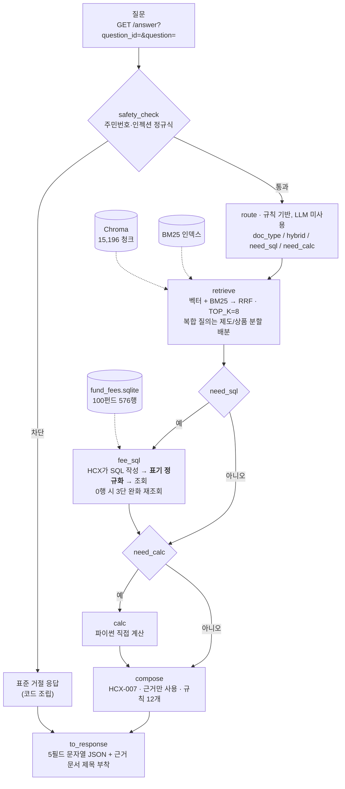
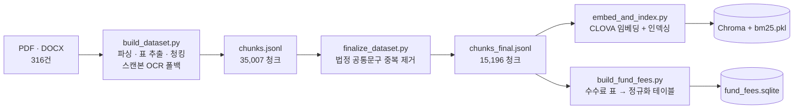
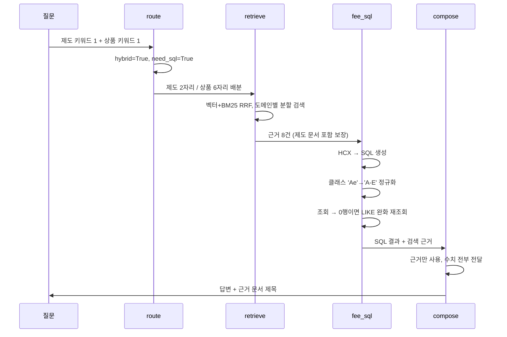
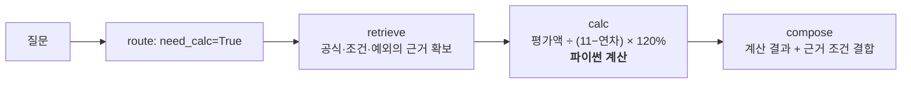
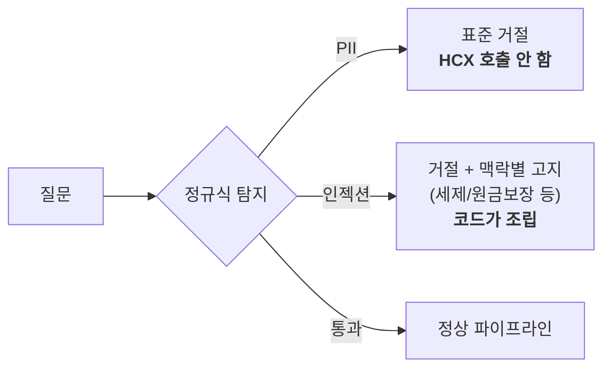

# 기술 제안서 — 연금 Agent

제10회 2026 미래에셋증권 AI Festival · 과제: 연금 Agent

| | |
|---|---|
| 산출물 저장소 | 본 저장소 |
| 평가용 엔드포인트 | `http://211.188.59.247/answer` *(2026-09-01 배포, 운영 중)* |
| 사용 LLM | HyperCLOVA X (HCX-007) — 생성·Text2SQL 전 구간 |
| 문서 버전 | 2026-09-03 |

---

## 1. 제안 요약

**연금 상담 질의는 한 가지 종류가 아닙니다.** "DB와 DC의 차이"는 제도 문서를 읽으면 되고, "A-e 클래스 총보수"는 수수료 표를 조회해야 하며, "연금수령한도가 얼마냐"는 공식에 숫자를 넣어 계산해야 합니다. 이 셋을 하나의 RAG 파이프라인으로 처리하면 **잘하는 질문은 낭비하고, 못하는 질문은 틀립니다.**

저희는 두 가지 결정으로 이 문제를 풀었습니다.

**① 질문별 동적 파이프라인.** 규칙 기반 `route` 노드가 질문을 읽고 실행할 노드를 먼저 결정합니다. 제도 질문은 3개 노드로 끝나고, 수수료 질문만 Text2SQL을 타고, 계산 질문만 Calculator를 탑니다. 라우팅에 LLM을 쓰지 않기 때문에 **같은 질문은 항상 같은 경로를 타고**, 호출 1회를 아껴 300초 데드라인에 여유가 생깁니다.

**② SQL 표기 정규화 계층.** LLM이 만든 SQL은 문법은 맞는데 **리터럴이 DB의 실제 값과 어긋나는** 경우가 대부분이었습니다. 프롬프트로 고치려다 실패했고, 결국 생성된 SQL을 실행 전에 **코드가 다시 쓰는** 계층을 만들었습니다. 클래스 표기·판매경로·펀드명 공백·연산자 우선순위를 흡수하고, 0행이면 완화 재조회까지 한 뒤에도 못 찾으면 그 사실을 생성 단계로 전달합니다.

이 두 결정으로 자체 평가셋 정답률 77.5~90%, 근거 제공률 73~95%, **홀드아웃 24문항 가중 종합 79.1~81.5%(3회 측정, 중앙값 79.1%)** 를 확보했습니다.

---

## 2. 문제 정의

### 2.1 도메인이 만드는 세 가지 어려움

**첫째, 하나의 질문에 여러 종류의 근거가 필요합니다.**

> "실물이전 사전조회는 어디서 하고, A-e 클래스 총보수는 얼마인가요?"

앞은 제도 문서, 뒤는 투자설명서의 수수료 표입니다. 그냥 검색하면 질문에 펀드명이 들어간 순간 벡터·BM25 양쪽에서 상품 문서가 상위를 독식해 **제도 문서가 근거에 하나도 안 들어옵니다.** 저희 초기 측정에서 이런 복합 질의의 정확도가 49.1%로 전체 최하였고, 원인이 정확히 이것이었습니다.

**둘째, 숫자를 요약하면 답이 틀립니다.**

연금은 "대략 1% 정도"가 답이 될 수 없는 도메인입니다. 총보수 0.72%와 1.30%는 다른 상품이고, 세액공제 한도 600만원과 900만원은 다른 제도입니다. 그런데 LLM은 근거에 있는 수치를 요약하거나, 심하면 표 조각에서 숫자처럼 생긴 문자열(`BL292`)을 총보수라고 주워 온 적도 있습니다.

**셋째, 모르는 것을 모른다고 말해야 합니다.**

과제 평가지표에 "정보한계 대응"이 명시되어 있습니다. 보유 데이터로 답할 수 없는 질의를 식별하고, 무리한 답변 대신 한계를 고지하거나 역질문해야 합니다. 이것은 프롬프트로 "모르면 모른다고 해"라고 시켜서는 잘 안 됩니다 — 모델은 근거가 부족해도 그럴듯한 문장을 만들어냅니다.

### 2.2 데이터가 만드는 어려움

| 문제 | 실제로 겪은 것 |
|---|---|
| 법정 공통문구 중복 | 투자설명서 100개가 자본시장법상 동일 문구(수익자총회·손해배상책임 등)를 공유. 그대로 임베딩하면 "수익자총회가 뭐야?"에 **똑같은 청크 24개**가 상위를 채움 |
| 고유명사·코드 검색 | `종류C-P2`, `KR5157450090`은 임베딩 공간에서 서로 뭉쳐 벡터 검색만으로는 정확한 하나를 못 집음 |
| 한글 조사 결합 | `"실물이전으로"` ≠ `"실물이전"`. IDF 8.09짜리 강한 신호가 죽고 순위가 19위로 밀림 |
| 표의 구조 손실 | 수수료율·세율은 **행과 열의 대응이 의미**. 평문으로 펴면 데이터가 거짓말을 시작함 |

---

## 3. 제안 방법

### 3.1 핵심 설계 원칙 — LLM을 쓸 곳과 안 쓸 곳을 먼저 정한다

| 단계 | LLM | 이유 |
|---|:---:|---|
| 라우팅 | ❌ 규칙 | 온도 때문에 같은 질문이 실행마다 다른 경로를 탐. 호출 1회는 데드라인 비용 |
| 검색 | ❌ 결정적 | 임베딩+BM25는 온도가 없어 **실행마다 결과가 동일**. 회귀 판단의 기준선이 됨 |
| 안전성 가드 | ❌ 정규식 | LLM에게 "거절해라"라고 시키면 우회당함. 민감정보를 외부 API로 보내기 전에 막아야 함 |
| Text2SQL | ✅ HCX-007 | 자연어→SQL은 LLM이 잘함. 단, **결과물을 코드가 검증·재작성** |
| 계산 | ❌ 파이썬 | LLM은 자릿수를 틀림. `평가액/(11−연차)×120%`를 `×(11−연차)`로 계산해 8배 오류를 낸 실측 사례 |
| 답변 생성 | ✅ HCX-007 | 근거 조립과 자연어 표현 |

> **대회 규정 준수**: 답변 생성과 에이전트 워크플로우의 LLM은 전 구간 HyperCLOVA X(HCX-007)입니다. 계산·정규화·라우팅은 LLM이 아닌 순수 파이썬이므로 규정 대상이 아닙니다.

### 3.2 차별화 ① — 질문별 동적 파이프라인

`route`가 질문에서 **제도 키워드 수**와 **상품 키워드 수**를 세고, 그 조합으로 실행 계획을 만듭니다.

| 판정 | 조건 | 효과 |
|---|---|---|
| `doc_type=연금문서` | 제도 ≥2, 상품 0 | 760청크로 검색 범위 축소 — **실측 +5.5%p** |
| `doc_type=투자설명서` | 상품 ≥2, 제도 0 | 14,273청크로 축소 |
| `hybrid=True` | 제도 ≥1 **그리고** 상품 ≥1 | **제도·상품을 나눠 검색하고 합침** — 한쪽 독식 방지 |
| `tax_mix=True` | 제도로 좁혔는데 세법 조문 키워드 존재 | 좁힌 것을 풀고 투자설명서 세제 부록에 2자리 확보 |
| `need_sql=True` | 수치 비교·정렬 표현 | `fee_sql` 노드 활성화 |
| `need_calc=True` | 연금수령한도 등 확정 공식 | `calc` 노드 활성화 |

**`hybrid` 분할 검색이 2.1절 첫째 문제의 답입니다.** 복합 질의에서 `TOP_K=8`을 제도 2 / 상품 6(또는 그 반대)으로 **강제 배분**해, 펀드 문서가 8자리를 전부 먹는 상황을 구조적으로 막습니다.

**애매하면 좁히지 않습니다.** 잘못 좁히면 정답을 아예 못 보지만, 안 좁히면 순위만 밀립니다. 평가셋 40문항에서 잘못 좁힌 사례는 0건입니다.

### 3.3 차별화 ② — SQL 표기 정규화 계층

`fee_sql`이 하는 일의 대부분은 SQL 생성이 아니라 **생성된 SQL의 교정**입니다.

| 흔들림 | LLM이 쓴 것 | DB 실제 값 | 흡수 방법 |
|---|---|---|---|
| 클래스 표기 | `'Ae'`, `'A-e'` | `'A-E'` | 하이픈·대소문자 제거 후 비교 |
| 판매경로 | `'온라인직접판매'` | `'온라인'`, `'온라인슈퍼'` | 슈퍼를 명시하면 정확일치, 아니면 `LIKE '온라인%'` |
| 펀드명 공백 | `'NH-Amundi하나로단기채'` | `'NH-Amundi 하나로 단기채 …'` | 양쪽 공백 제거 후 비교 |
| 연산자 우선순위 | `A AND B OR C` | — | 괄호 강제 |
| 집계 오용 | 비교 질문에 `MIN()` | — | 프롬프트 금지 + 파이썬 재정렬 |
| `LIMIT` 절단 | 다중 펀드 `OR` 비교에 `LIMIT 5` | — | 실행 전 최상위 `LIMIT` 제거 |
| 주석 접두 | ` -- 총보수 비교` + SQL | — | 주석 스트립 후 파싱 |
| 계좌유형 혼입 | `class_code IN ('개인연금')` | `account_type = '연금저축'` | 정규화 후 **완전일치**일 때만 account_type 조건으로 이관 (`S-퇴직` 같은 실제 코드 보호) |
| 계좌유형 동의어 | `account_type = '개인연금'` | `'연금저축'`/`'퇴직연금'` 둘뿐 | 동의어 집합 매핑 — 치환 대상은 DB에서 읽은 실제 값으로만 한정 |

판매경로는 **양방향으로 틀릴 수 있어** 판정을 한 번 더 나눴습니다. 사용자가 "온라인
가입"이라고만 하면 정답 클래스의 채널이 `온라인슈퍼`인 경우가 있어 넓게 잡아야 하고,
반대로 **"온라인슈퍼"라고 명시**하면 `온라인` 클래스까지 끌어와 엉뚱한 보수를 답하게
됩니다. 둘 다 실측으로 확인한 실패라, 리터럴에 '슈퍼'가 있으면 정확일치로 좁히고
없으면 확장합니다.

여기에 **3단 안전망**이 붙습니다.

```
1차 조회 → 0행이면 펀드명을 LIKE로 완화해 재조회 (정규화 전부 재적용)
         → account_type 조건이 남아 있으면 그 조건만 떨어뜨리고 재조회
           (정규화로도 못 알아본 계좌유형 표현이면 조건이 틀렸을 공산이 크다)
         → OR 그룹 중 0행인 조건만 골라 개별 완화
         → 그래도 못 찾으면: text2sql이 놓친 펀드를 질문 원문에서 직접 찾아 SQL 재구성
         → 최종 실패 시 "조회 불가"를 compose에 명시 전달
```

**마지막 줄이 중요합니다.** 예전에는 0행을 조용히 넘겼고, 그러면 LLM이 검색 근거의 표 조각에서 숫자처럼 생긴 것을 주워 왔습니다. 지금은 "SQL로 못 찾았다"는 사실 자체가 근거로 전달되어, 답변이 조회 불가를 **말로 명시**합니다.

프롬프트에 **채널별 실존 클래스 목록을 주입**하는 방식도 시도했으나 기각했습니다.
같은 코드로 홀드아웃을 반사실 비교한 결과(주입 포함 종합 74.0% vs 제외 79.1~81.5%),
목록이 오히려 모델의 클래스 추측을 부추겨 계좌유형 조건을 빠뜨리게 만들었고,
주입이 겨냥했던 문항은 위 정규화 계층만으로 이미 해결돼 있었습니다. 프롬프트를
늘리는 개선은 반사실 측정으로 순이득을 확인한 뒤에만 남깁니다.

### 3.4 안전성과 정보한계 대응

| 항목 | 구현 |
|---|---|
| PII 차단 | 주민등록번호·카드번호 정규식. **HCX 호출 이전**에 표준 거절 응답 반환 → 민감정보가 외부 API로 나가지 않음 |
| 프롬프트 인젝션 | 마커 기반 탐지. 거절 응답을 **코드가 조립** (생성에 맡기면 우회됨) |
| 단정 추천 금지 | 확인조건을 먼저 제시하고 상황별 결론 제공 |
| 조회 불가 명시 | SQL·검색 실패를 compose까지 전달, 답변에 표현 그대로 노출 |
| 없는 상품 역질문 | 계열 번호 판정을 코드로 하고, 존재하지 않는 계열이면 역질문 형식으로 고정 |
| 근거 문서 표시 | 답변 끝에 실제 사용한 문서의 **제목**을 자동 부착 (과제자료 p.07 요구사항) |

**오탐 0/66** — 정상 질의 66문항에서 잘못 차단한 사례 없음.

### 3.5 검색 계층 설계

- **하이브리드 + RRF**: 벡터(Chroma) + BM25를 `RRF_K=60`으로 융합. "중도인출하면 세금 얼마나 떼?"는 벡터가, "종류C-P2 판매보수"는 BM25가 강합니다.
- **`TOP_K=8` 고정**: k=5에서 근거 충족률 88.9%로 최고. k=20은 +2.8%p인데 컨텍스트가 4배 — 300초 데드라인에 불리합니다. 복합 질의 분할 배분을 위해 8로 운용합니다.
- **계열 펀드 분할 검색**: "솔로몬 국공채 단기·중장기·장기" 같은 비교 질의는 펀드별로 나눠 검색해 합칩니다. 한 펀드가 상위를 독식해 나머지가 근거에서 빠지는 문제를 막습니다.
- **완전일치 중복만 병합**: 유사 중복은 병합하지 않습니다. 숫자만 다른 두 청크는 "같은 서식의 다른 수수료율"일 수 있고, 0.72%와 1.30%를 합치는 순간 데이터셋이 거짓말을 시작합니다.

---

### 3.6 공통 청크 신원 복구 — 수수료 DB 완전 커버리지

중복 병합은 같은 문구를 공유하는 청크의 `fund_code`를 지우고 원 소속을 `doc_ids`에
남깁니다. 의도된 설계지만 부작용이 있었습니다 — 같은 펀드가 코드 2~3개로 등록된
**쌍둥이 문서는 청크 전부가 '공통'이 되어**, 16개 펀드가 수수료 DB에서 통째로
빠졌습니다. 조용한 누락이라 "그 펀드는 확인되지 않습니다"로만 드러났습니다.

읽는 쪽에서 복구했습니다: `doc_ids`와 manifest로 신원을 되살리고, 요약표가 평문으로
풀린 레이아웃과 '종류' 앵커 내역표 레이아웃을 파서에 추가해, `fund_fees`가
**76펀드 408행 → 100펀드 576행**으로 늘었습니다(재임베딩 없이 DB 재생성만).
남긴 한계도 기록합니다: 청크 경계가 클래스 라벨을 절단해 코드를 복원하지 못한 행이
1건 있습니다 — 보수율·채널·계좌유형은 참값이라 행은 유지했습니다.

## 4. 시스템 구성도

### 4.1 온라인 (질의 응답)



### 4.2 오프라인 (인덱스 구축, 1회성)



### 4.3 데이터 구조화 설계

**청크 스키마** — 출처 추적이 가능하도록 펀드코드·페이지·섹션을 필드로 보존합니다. 통합 txt나 엑셀로는 "이 수수료율이 어느 펀드 몇 페이지에서 나왔는지"를 구조적으로 잃습니다.

```json
{
  "chunk_id": "KR5157450090_p23_0071",
  "doc_id": "KR5157450090",
  "doc_type": "투자설명서",
  "fund_code": "KR5157450090",
  "fund_name": "마이다스 거북이 90 증권 자투자신탁 1호(주식)",
  "base_date": "2025-10-01",
  "page": 23,
  "section": "(2) 종류별 수수료 및 보수에 관한 사항",
  "content_type": "table",
  "text": "| 구분 | 선취 판매수수료 | ... |",
  "source_path": "투자설명서/KR5157450090/R2_KR5157450090.pdf"
}
```

**`fund_fees` 테이블** — 표 청크를 파싱해 15개 컬럼의 정규화 테이블로 재구성했습니다. 검색으로는 "가장 싼 것 3개"를 정렬할 수 없기 때문입니다.

```
fund_code · fund_name · base_date · class_label · class_code · account_type
channel · front_load_text · fee_total · fee_distribution · fee_peer_avg
fee_total_cost · chunk_id · page · source_path
```

`chunk_id`·`page`·`source_path`를 함께 보관해, **SQL로 찾은 수치에도 원문 출처를 붙일 수 있습니다.**

### 4.4 데이터 규모

| | 수량 |
|---|---|
| 원본 문서 | 316건 (OK 314 / LOW_YIELD 2) |
| 청크 (중복 제거 전) | 35,007 |
| 청크 (인덱싱 대상) | **15,196** — 투자설명서 14,273 / 연금문서 760 / 기타 163 |
| `fund_fees` | **100펀드 576행** (공통 청크 신원 복구 후, 3.6절) |

---

## 5. 주요 기능 흐름도

### 5.1 복합 질의 — "실물이전 사전조회는 어디서 하고, A-e 총보수는?"



### 5.2 계산 질의 — "연금수령한도가 얼마인가요?"



> **검색은 계산 질의에도 항상 실행합니다.** 숫자만으로는 출처를 달 수 없고, 수치 옆에 붙일 조건·예외·기준일이 문서 쪽에만 있기 때문입니다.

### 5.3 위험 질의 — 인젝션·PII



---

## 6. 사용자 시나리오

### 시나리오 A — 은퇴를 앞둔 58세 고객

> **고객**: "58세인데, 크게 잃지 않으면서 굴릴 상품 하나 추천해 주세요."

단정 추천을 하지 않습니다. 계좌 종류·투자기간·감내 위험을 먼저 확인하고, 조건별로 후보를 제시합니다. 저위험 지향이면 국공채·초단기 채권형이 후보라는 식으로 **조건을 전제한 결론**을 냅니다. 답변 끝에는 근거로 삼은 문서 제목이 붙습니다.

### 시나리오 B — 세액공제를 확인하려는 직장인

> **고객**: "연금저축이랑 IRP에 넣으면 세액공제 얼마까지 되나요? 다 합쳐서요."

연금저축 한도와 합산 한도를 **별개 한도로 오해해 더하는 오류**가 실제로 발생했고, 이를 프롬프트 규칙으로 차단했습니다. 지금은 합산 기준을 먼저 밝히고 소득 구간별 공제율을 함께 제시합니다.

### 시나리오 C — 상품을 비교하는 가입자

> **고객**: "솔로몬 국공채 단기·중장기·장기, 뭐가 달라요? 안정적인 걸 원해요."

계열 펀드 비교 질의로 판정해 펀드별 분할 검색을 수행하고, `fee_sql`로 클래스별 총보수를 조회합니다. 한 펀드가 근거를 독식해 나머지가 빠지는 일이 없도록 자리를 나눠 배분합니다.

### 시나리오 D — 보유 데이터로 답할 수 없는 질의

> **고객**: "제 IRP 계좌 잔고가 얼마죠?"

계좌 조회 기능이 없다는 사실을 **말로 명시**하고, 어디로 가야 하는지를 창구 이름으로 안내합니다. 모르는 개념은 지어내지 않고 모른다고 답합니다.

---

## 7. 검증 체계

### 7.1 자체 평가셋

| 평가셋 | 문항 | 성격 |
|---|---:|---|
| `evalset_v1` | 40 | 초기 커버리지 확인 |
| `evalset_v4_stress_36` | 36 | 다중조건·전제교정 중심 스트레스셋 |
| `evalset_ext30` | 30 | 제도 확장 커버리지 |
| `gold_holdout_v4` | 24 | **홀드아웃(현행)** — 과제 평가지표 7종에 맞춰 카테고리 부여 |
| `killing_camp_v1` | 40 | 자체 적대적 평가셋 |

> 평가셋 원본(`gold_holdout_v3`, `killing_camp_v1`, `evalset_v4/v5` 등)은
> 팀 내부 blind 평가의 유효성을 지키기 위해 저장소에서 제외했습니다.
> 채점 스크립트(`eval_answers.py`, `score_official.py`, `score_avg.py`)와
> 초기 평가셋 `evalset_v1`·`evalset_v2`는 포함되어 있어 채점 방식은
> 그대로 확인하실 수 있습니다.

### 7.2 최근 측정 (2026-09-03)

생성 변동 때문에 단일 회차 수치를 쓰지 않고, **다회 측정의 범위와 중앙값**으로 적습니다.

| 평가셋 | 회차 | 결과 | 측정일 |
|---|---|---|---|
| 홀드아웃 v4 24문항 (가중 종합, 자체 배점 가정) | **3회** | **79.1~81.5% (중앙값 79.1%)** | 09-03 |
| v1 40문항 정답률 / 근거 제공률 | 2회 | 77.5~82.5% / 95.0% | 09-03 |
| v4 stress 36문항 | 1회 | 80.6% / 80.6% | 08-31 |
| ext30 30문항 | 1회 | 90.0% / 73.3% | 08-31 |

홀드아웃 축별(3회, 범위·중앙값): 답변 정확도 69.9~75.3(69.9) / 검색 커버리지 86.2 /
출처 79.2 / 근거 정합성 98.3~100(100). freeze **74.9%**(09-01, 1회) 대비 개선.
회차별 원시 결과: `raw_h3_cfA.json` · `raw_h3_cfB.json` · `raw_h3_cfC.json` (git 제외 대상, 로컬 보관).

> ⚠️ **공정성 표기 원칙**: 정답지를 연 뒤 튜닝한 값은 freeze 값과 **항상 함께** 적습니다. 공식 v4 30문항의 경우 freeze 66.7% / post-tune 80.0%입니다.

### 7.3 회귀 판단 방식

생성은 온도가 있어 실행마다 흔들리지만 **검색은 결정적**입니다(여러 번 돌려도 출처 점수가 소수점까지 동일). 그래서 회귀를 판단할 때는 `score_avg.py`로 같은 코드 반복 실행의 **오차범위를 먼저 잡고** 비교합니다. 그 범위 안의 변화는 회귀가 아닙니다.

### 7.4 기각한 개선안 (실측 후 폐기)

같은 실험을 반복하지 않기 위해 실패도 기록합니다.

| 시도 | 결과 | 판정 |
|---|---|---|
| 목차 청크 8개 제거 | 52.8% → 44.4% | ❌ 그 청크에 실제 답변도 포함 |
| BM25에서 2-gram 제거 | 94.4% → 77.8% | ❌ 2-gram은 한글 조사 대응에 필수 |
| 원어 토큰 3배 가중 | 94.4% → 88.9% | ❌ 깊이에서 손해 |
| 3-gram 추가 | 3개 개선, 3개 회귀 | ⚠️ 순이득 0 |
| **doc_type 라우팅** | 77.8% → **83.3%** | ✅ 유효 — `route()`에 반영 |

---

### 7.5 측정 변동성 관리와 실패 이력

같은 코드를 반복 실행해도 HCX 생성 변동으로 총점이 회차마다 수 %p 흔들립니다
(v1 실측 밴드 77.5~85.0%). 그래서 세 가지 규칙을 운영합니다.

1. **단일 회차로 판단하지 않습니다.** 변경 전후 비교는 다회 측정으로, 문서 수치는
   범위와 중앙값으로 적습니다.
2. **회귀는 총점이 아니라 문항 단위로 판정합니다.** 모든 측정의 실패 문항을 누적
   이력 파일(`eval_fail_history_v1.json`, 저장소 포함)에 합치고, **이력에 없던
   문항이 실패할 때만** 중단·조사합니다. 실행되지 않은 코드는 원인일 수 없으므로,
   판단 근거는 트레이스입니다.
3. **채점기 아티팩트를 구분해 기록합니다.** 자체 채점은 문자열 매칭이라, 내용이
   정답인데 표현이 달라 실패로 잡히는 사례("세금이 없다" vs 키워드 '비과세',
   "0.3%" vs '0.30%')를 실측으로 확인했습니다. 이런 문항은 원문을 열어 확인한
   뒤에만 실패로 취급합니다 — 채점기에 맞춰 표현을 유도하는 프롬프트 수정은
   과적합이라 하지 않습니다.

## 8. 기대효과

### 8.1 상담 현업에서의 효과

| 효과 | 근거 |
|---|---|
| **1차 응대 자동화** | 제도·세제·상품 문의의 반복 질문을 근거와 함께 즉시 응대. 상담원은 판단이 필요한 건에 집중 |
| **답변 편차 제거** | 라우팅·계산·안전성이 코드로 고정되어 상담원·시점에 따른 설명 차이가 없음 |
| **컴플라이언스 대응** | 모든 답변에 근거 문서가 붙어 **사후 검증이 가능**. 단정 추천을 구조적으로 금지 |
| **오정보 리스크 감소** | PII·인젝션을 LLM 호출 전에 차단. SQL 조회 실패를 은폐하지 않고 명시 |

### 8.2 리스크 관리

| 리스크 | 대응 |
|---|---|
| 할루시네이션 | 근거 밖 내용 생성 금지를 프롬프트 규칙으로 고정 + `retrieved_context` 반환으로 검증 가능 |
| 민감정보 유출 | 정규식 탐지를 외부 API 호출 **이전** 단계에 배치 |
| 잘못된 수치 | 확정 공식은 파이썬 계산, 수수료는 SQL 조회. LLM에게 산술을 맡기지 않음 |
| 평가셋 과적합 | 특정 펀드명·키워드 하드코딩 금지를 작업 원칙으로 명문화. 홀드아웃으로 별도 검증 |
| 응답 지연 | 라우팅으로 불필요 노드 스킵. `TOP_K=8` 고정으로 컨텍스트 상한 관리 |

---

## 9. 확장성

### 9.1 데이터 확장

`doc_type`이 라우팅의 축이므로, 새 문서군(예: 보험 약관, 세법 개정 고시)을 추가할 때 **파이프라인 구조를 바꾸지 않고** 청킹 → 인덱싱 → 라우팅 힌트 추가만으로 확장됩니다. 임베딩은 `emb_cache.sqlite`에 `text_hash`로 캐싱되어 재빌드 비용이 증분에만 발생합니다.

### 9.2 노드 확장

노드를 함수로 분리하고 입출력을 **하나의 state 딕셔너리로 통일**해 두었습니다. 새 기능(예: 수익률 시계열 비교, 포트폴리오 시뮬레이션)은 노드 함수 하나를 추가하고 `route`에 판정 규칙 한 줄을 더하면 붙습니다. 노드가 늘어나 오케스트레이션이 복잡해지는 시점에는 LangGraph로 이관할 수 있도록 인터페이스를 맞춰 두었습니다.

> 현재는 LangGraph를 쓰지 않습니다. 노드가 소수일 때는 얻는 것보다 디버깅 비용이 큽니다.

### 9.3 운영 확장

- **`think_trace` 전 구간 기록** — 어느 노드가 무엇을 했는지 문자열로 남아, 장애 시 재현 없이 원인을 좁힐 수 있습니다.
- **컨테이너화** — `Dockerfile` + `requirements.txt`로 환경이 고정됩니다.
- **무중단 운영** — systemd `Restart=always` + nginx 리버스 프록시. `proxy_read_timeout 320s`로 장문 응답이 프록시에서 끊기지 않게 했습니다.

---

## 10. 제출 산출물

| 항목 | 위치 |
|---|---|
| 소스코드 | 본 저장소 (`agent.py`, `search.py`, `server.py`, 데이터 파이프라인 4종) |
| 실행 환경 정의 | `Dockerfile`, `requirements.txt`, `README.md` |
| 배포 가이드 | `deploy/DEPLOY.md`, `deploy/nginx.conf`, `deploy/agent-server.service` |
| 데이터 스키마 | `DATA_INTERFACE.md` |
| 평가·진단 도구 | `eval_answers.py`, `score_official.py`, `score_avg.py`, `run_eval.py` |
| 기술 제안서 | 본 문서 |

### 평가용 API 명세

```
GET {endpoint}/answer?question_id={id}&question={질의}
```

**요청**

| 파라미터 | 타입 | 설명 |
|---|---|---|
| `question_id` | string | 주최측 문항 ID |
| `question` | string | 질의 원문 (URL 인코딩) |

인증 헤더 없음. 경로 `/answer` 고정.

**응답** — `Content-Type: application/json`, 5개 필드 **전부 문자열**

```json
{
  "question_id": "Q-001",
  "question": "평가 질의 원문",
  "retrieved_context": "답변 생성에 참고한 검색 문서",
  "think_trace": "사고 · 추론 · 도구 사용 과정",
  "answer": "최종 생성 답변"
}
```

| 항목 | 값 |
|---|---|
| 포트 | 80 (HTTP) |
| 타임아웃 | 300초 이내 응답 |
| 평균 응답시간 | 약 7.5초 (최대 16.9초, 배포 API 40문항 실측) |
| 운영 기간 | 09.07 ~ 09.20 무중단 |
