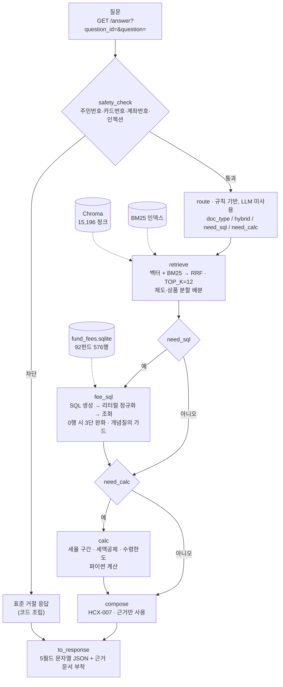
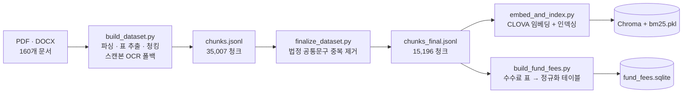
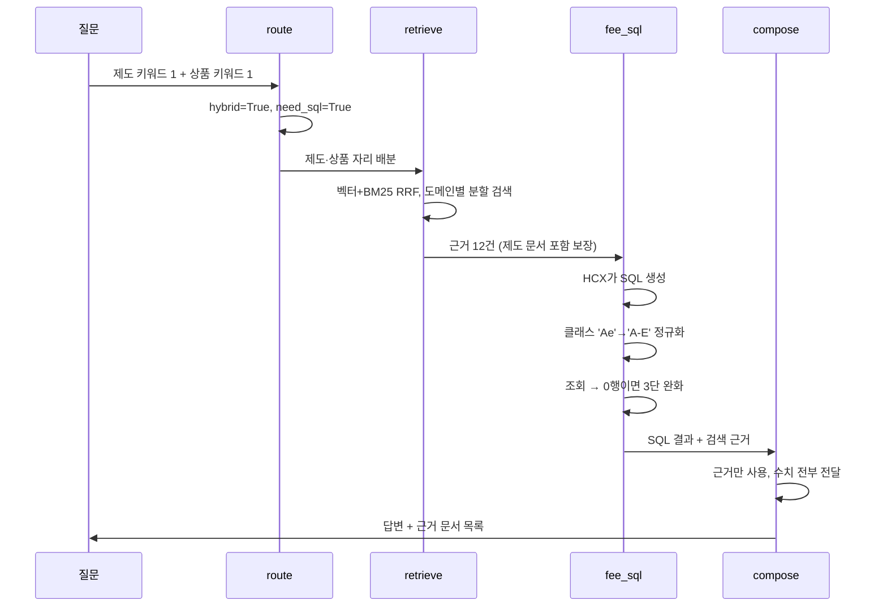
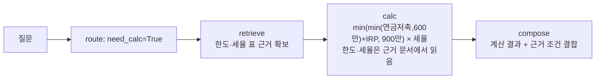
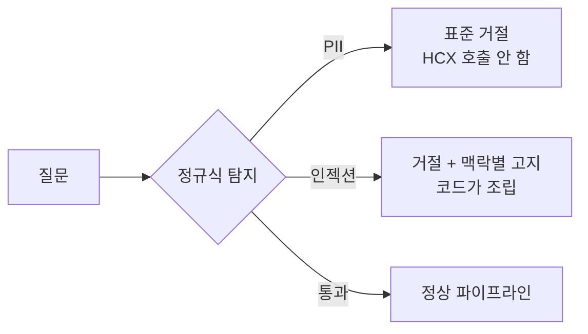

# 기술 제안서 — 연금 Agent

제10회 2026 미래에셋증권 AI Festival · 과제: 연금 Agent

| | |
|---|---|
| 산출물 저장소 | 본 저장소 |
| 평가용 엔드포인트 | `http://211.188.59.247/answer` |
| 사용 LLM | HyperCLOVA X (HCX-007) — 생성·Text2SQL 전 구간 |
| 심사 대상 커밋 | `af91008` |
| 문서 버전 | 2026-09-06 |

---

## 1. 제안 요약

연금 상담 질의는 한 종류가 아닙니다. "DB와 DC의 차이"는 제도 문서를 읽으면 되고, "A-e 클래스 총보수"는 수수료 표를 조회해야 하며, "연금수령한도"는 공식에 숫자를 넣어야 합니다. 셋을 하나의 RAG 파이프라인으로 처리하면 쉬운 질문에는 낭비가, 어려운 질문에는 오답이 생깁니다.

두 가지 결정으로 이 문제를 풀었습니다.

첫째, 질문마다 파이프라인을 다시 조립합니다. 규칙 기반 `route` 노드가 실행할 노드를 먼저 정하고, 켜진 노드만 실행합니다. 라우팅에 LLM을 쓰지 않으므로 같은 질문은 항상 같은 경로를 타고, 호출 한 번을 아껴 300초 데드라인에 여유가 생깁니다.

둘째, LLM이 흔들리는 자리를 코드로 옮겼습니다. Text2SQL이 만든 SQL을 실행 전에 코드가 교정하고, 세율 구간과 세액공제액을 파이썬으로 계산하며, 민감정보 차단을 정규식으로 처리합니다. 이 원칙은 개발 후반에 실측으로 한 번 더 확인됐습니다. 프롬프트에 규칙을 더하는 방식이 반복해서 실패하는 동안, 같은 문제를 코드로 옮긴 수정은 모두 성공했습니다(3.7절).

자체 평가셋 기준 정답률은 92.5~95.0%, 근거 제공률은 97.5%입니다(evalset_v1 · 40문항 · 2회 · 09-03 코드). 별도로 50문항 감사셋과 28문항 진단셋으로 세 차례 감사한 결과, 치명 결함은 3건에서 0건으로, 중대 결함은 5건에서 1건으로 줄었습니다(7.3절).

---

## 2. 문제 정의

### 2.1 도메인이 만드는 어려움

**하나의 질문에 여러 종류의 근거가 필요합니다.**

> "실물이전 사전조회는 어디서 하고, A-e 클래스 총보수는 얼마인가요?"

앞은 제도 문서, 뒤는 투자설명서의 수수료 표입니다. 그냥 검색하면 질문에 펀드명이 들어간 순간 벡터와 BM25 양쪽에서 상품 문서가 상위를 독식해 제도 문서가 근거에 하나도 들어오지 않습니다. 초기 측정에서 이런 복합 질의의 정확도가 49.1%로 전체 최하였고(팀 blind · 56문항 중 복합 유형 · 08월), 원인이 정확히 이것이었습니다.

**숫자를 요약하면 답이 틀립니다.**

연금은 "대략 1% 정도"가 답이 될 수 없는 도메인입니다. 총보수 0.72%와 1.30%는 다른 상품이고, 세액공제 한도 600만원과 900만원은 다른 제도입니다. 그런데 모델은 근거에 있는 수치를 요약하거나, 심하면 표 조각에서 숫자처럼 생긴 문자열(`BL292`)을 총보수라고 주워 옵니다.

**모르는 것을 모른다고 말해야 합니다.**

평가지표에 "정보한계 대응"이 명시되어 있습니다. 보유 데이터로 답할 수 없는 질의를 식별하고, 무리한 답변 대신 한계를 고지하거나 역질문해야 합니다. 이것은 프롬프트로 "모르면 모른다고 해"라고 시켜서는 잘 되지 않습니다. 근거가 부족해도 모델은 그럴듯한 문장을 만들어냅니다.

### 2.2 데이터가 만드는 어려움

| 문제 | 실제로 겪은 것 |
|---|---|
| 법정 공통문구 중복 | 투자설명서 100개가 자본시장법상 동일 문구를 공유. 그대로 임베딩하면 "수익자총회가 뭐야?"에 똑같은 청크 24개가 상위를 채움 |
| 고유명사·코드 검색 | `종류C-P2`, `KR5157450090`은 임베딩 공간에서 서로 뭉쳐 벡터 검색만으로는 정확한 하나를 집지 못함 |
| 한글 조사 결합 | `"실물이전으로"` ≠ `"실물이전"`. IDF 8.09짜리 강한 신호가 죽고 순위가 19위로 밀림 |
| 표의 구조 손실 | 수수료율·세율은 행과 열의 대응이 의미. 평문으로 펴면 데이터가 거짓말을 시작함 |

---

## 3. 제안 방법

### 3.1 설계 원칙 — LLM을 쓸 곳과 안 쓸 곳을 먼저 정한다

| 단계 | LLM | 이유 |
|---|:---:|---|
| 라우팅 | 규칙 | 온도 때문에 같은 질문이 실행마다 다른 경로를 탐. 호출 한 번은 데드라인 비용 |
| 검색 | 결정적 | 임베딩과 BM25는 온도가 없어 실행마다 결과가 동일. 회귀 판단의 기준선이 됨 |
| 안전성 가드 | 정규식 | 모델에게 거절을 시키면 우회당함. 민감정보를 외부 API로 보내기 전에 막아야 함 |
| Text2SQL | HCX-007 | 자연어를 SQL로 바꾸는 일은 모델이 잘함. 단, 결과물을 코드가 검증하고 재작성 |
| 계산 | 파이썬 | 모델은 자릿수를 틀림. `평가액/(11−연차)×120%`를 `×(11−연차)`로 계산해 8배 오류를 낸 사례가 있음 |
| 답변 생성 | HCX-007 | 근거 조립과 자연어 표현 |

대회 규정 준수: 답변 생성과 에이전트 워크플로우의 LLM은 전 구간 HyperCLOVA X(HCX-007)입니다. 계산·정규화·라우팅은 순수 파이썬이므로 규정 대상이 아닙니다.

### 3.2 질문별 동적 파이프라인

`route`가 질문에서 제도 키워드 수와 상품 키워드 수를 세고, 그 조합으로 실행 계획을 만듭니다.

| 판정 | 조건 | 효과 |
|---|---|---|
| `doc_type=연금문서` | 제도 2 이상, 상품 0 | 760청크로 검색 범위 축소. 실측 +5.5%p (검색 기준선 · 36문항 · 08월) |
| `doc_type=투자설명서` | 상품 2 이상, 제도 0 | 14,273청크로 축소 |
| `hybrid=True` | 제도 1 이상 | 제도와 상품을 나눠 검색하고 합침 |
| `tax_mix=True` | 제도로 좁혔는데 세법 조문 키워드 존재 | 좁힌 것을 풀고 투자설명서 세제 부록에 자리 확보 |
| `need_sql=True` | 수치 비교·정렬 표현 또는 펀드 지정 | `fee_sql` 노드 활성화 |
| `need_calc=True` | 확정 공식이 있는 계산 | `calc` 노드 활성화 |

애매하면 좁히지 않습니다. 잘못 좁히면 정답을 아예 못 보지만, 안 좁히면 순위만 밀립니다.

### 3.3 검색 자리 배분 — 한쪽 문서군의 독식 방지

`TOP_K=12`를 제도와 상품에 나눠 배분합니다. 비율은 질문 유형이 정합니다.

| 조건 | 제도 | 상품 |
|---|---:|---:|
| 상품 키워드 > 제도 키워드 | 2 | 10 |
| `need_sql` 또는 `tax_mix` 또는 상품 키워드 0 | 10 | 2 |
| 그 외 | 6 | 6 |

**제도 키워드가 하나뿐인 질문에도 분할을 켭니다.** 이 결정은 실측에서 나왔습니다. 켜지 않으면 코퍼스 비중이 큰 투자설명서 청크가 열두 자리를 모두 차지합니다. 세액공제 한도를 묻는 질문에서 정답 근거인 제도 문서가 한 건도 검색되지 않던 원인이 이것이었고, 같은 문서가 제도 키워드 2개인 다른 질문에서는 검색 1·2위로 나왔습니다. 색인 문제가 아니라 분할 점화 문제였습니다.

제도 문서를 검색할 때는 펀드코드 필터를 걸지 않습니다. 제도 문서에는 펀드코드가 없으므로 필터를 걸면 결과가 구조적으로 0건이 되고, 그러면 분할이 조용히 무산되어 상품 검색 결과만 남습니다. 이 경로는 로그도 남기지 않아 관측되지 않았습니다.

### 3.4 SQL 표기 정규화 계층

`fee_sql`이 하는 일의 대부분은 SQL 생성이 아니라 생성된 SQL의 교정입니다.

| 흔들림 | LLM이 쓴 것 | DB 실제 값 | 교정 |
|---|---|---|---|
| 클래스 표기 | `'Ae'`, `'A-e'` | `'A-E'` | 하이픈·대소문자 제거 후 비교 |
| 판매경로 | `'온라인직접판매'` | `'온라인'`, `'온라인슈퍼'` | 슈퍼 명시 시 정확일치, 아니면 `LIKE '온라인%'` |
| 펀드명 공백 | `'NH-Amundi하나로단기채'` | `'NH-Amundi 하나로 단기채 …'` | 공백 제거 후 비교 |
| 펀드명 태그 | `'%스팍스한국엄선투자[주식]%'` | `'스팍스한국엄선투자증권자투자신탁[주식]'` | 자산군 태그와 법적 명칭을 떼고 재조회 |
| 근거 없는 클래스 | 질문에 없는 `class_code='C-P'` | — | 클래스 신호가 없으면 조건 제거 |
| 연산자 우선순위 | `A AND B OR C` | — | 괄호 강제 |
| 집계 오용 | 비교 질문에 `MIN()` | — | 프롬프트 금지 + 파이썬 재정렬 |
| `LIMIT` 절단 | 다중 펀드 비교에 `LIMIT 5` | — | 실행 전 최상위 `LIMIT` 제거 |
| 계좌유형 혼입 | `class_code IN ('개인연금')` | `account_type = '연금저축'` | 완전일치일 때만 조건 이관 |

판매경로는 양방향으로 틀릴 수 있어 판정을 한 번 더 나눴습니다. 사용자가 "온라인 가입"이라고만 하면 정답 클래스의 채널이 `온라인슈퍼`인 경우가 있어 넓게 잡아야 하고, 반대로 "온라인슈퍼"라고 명시하면 `온라인` 클래스까지 끌어와 엉뚱한 보수를 답하게 됩니다. 둘 다 실측으로 확인한 실패입니다.

펀드명 태그 교정에는 안전장치를 붙였습니다. 태그를 떼고 조회한 결과가 둘 이상의 서로 다른 펀드에 걸치면 채택하지 않습니다. 사용자가 특정 펀드 하나를 지목했으므로, 여러 펀드에 걸친 매치는 성공이 아니라 모호한 매치입니다.

3단 안전망이 붙습니다.

```
1차 조회 → 0행이면 펀드명을 LIKE로 완화해 재조회 (정규화 전부 재적용)
         → 자산군 태그·법적 명칭을 떼고 재조회 (모호 매치면 미채택)
         → account_type 조건이 남아 있으면 그 조건만 떨어뜨리고 재조회
         → OR 그룹 중 0행인 조건만 골라 개별 완화
         → 최종 실패 시 "조회 불가"를 compose에 명시 전달
```

**마지막 줄이 중요합니다.** 예전에는 0행을 조용히 넘겼고, 그러면 모델이 검색 근거의 표 조각에서 숫자처럼 생긴 것을 주워 왔습니다. 지금은 조회 실패 자체가 근거로 전달되고, **질문이 지목하지 않은 펀드의 수수료를 답변에 넣지 못하게 막습니다.** 데이터가 DB에 실제로 있는데도 "확인되지 않습니다"라고 답하면서 무관한 펀드 아홉 개의 수수료를 나열한 사례가 실측으로 확인됐고, 이 가드가 그것을 차단합니다.

반대 방향의 가드도 있습니다. 펀드를 특정하지 않은 전체 조회인데 비교·정렬·집계 신호가 없으면 SQL 결과를 `compose`에 넘기지 않습니다. 개념을 묻는 질문에 50행짜리 표를 던지면 모델이 표에 끌려갑니다. 3.7절에서 이 판단의 근거를 설명합니다.

### 3.5 안전성과 정보한계 대응

| 항목 | 구현 |
|---|---|
| PII 차단 | 주민등록번호·카드번호·계좌번호 정규식. HCX 호출 이전에 표준 거절 반환 |
| 프롬프트 인젝션 | 마커 기반 탐지. 거절 응답을 코드가 조립 |
| 조회 불가 명시 | SQL·검색 실패를 compose까지 전달, 답변에 그대로 노출 |
| 없는 상품 역질문 | 계열 번호 판정을 코드로 하고, 존재하지 않는 계열이면 역질문 형식으로 고정 |
| 조건 미달 추천 | 개방형 추천 질의에서 필요한 정보를 먼저 되묻고, 투자권유가 아님을 명시 |
| 근거 문서 표시 | 답변 끝에 실제 사용한 문서 제목을 자동 부착 |

계좌번호 차단은 감사 과정에서 추가했습니다. 그 전까지 계좌번호가 포함된 요청은 정규식에 걸리지 않고 HCX까지 갔고, 모델이 자발적으로 거절해 겉으로는 차단된 것처럼 보였습니다. 모델의 자발적 거절은 확률적이므로 회차에 따라 뚫릴 수 있습니다. 코드 차단으로 바꿨습니다.

정상 질의 66문항에서 잘못 차단한 사례는 없습니다.

### 3.6 데이터 계층에서 고친 것들

**공통 청크 신원 복구.** 중복 병합은 같은 문구를 공유하는 청크의 `fund_code`를 지우고 원 소속을 `doc_ids`에 남깁니다. 의도된 설계지만 부작용이 있었습니다. 같은 펀드가 코드 두세 개로 등록된 쌍둥이 문서는 청크 전부가 공통이 되어, 16개 펀드가 수수료 DB에서 통째로 빠졌습니다. 조용한 누락이라 "그 펀드는 확인되지 않습니다"로만 드러났습니다.

읽는 쪽에서 복구했습니다. `doc_ids`와 manifest로 신원을 되살리고, 요약표가 평문으로 풀린 레이아웃과 '종류' 앵커 내역표 레이아웃을 파서에 추가해 `fund_fees`가 76펀드 408행에서 92펀드(펀드명 기준. 코드 기준 100) 576행으로 늘었습니다. 재임베딩 없이 DB 재생성만으로 처리했습니다. 청크 경계가 클래스 라벨을 절단해 코드를 복원하지 못한 행이 1건 있습니다. 보수율·채널·계좌유형은 참값이라 행은 유지했습니다.

**손상 추출본과 정상 추출본의 공존.** 투자설명서의 수수료 표는 PDF에서 두 경로로 추출됩니다. `table` 경로는 행과 열이 보존되지만, `text` 경로로 떨어진 청크는 헤더 어절이 여러 줄로 흩어지고 클래스 라벨이 숫자 줄과 분리되어 사람이 읽어도 어느 값이 어느 열인지 알 수 없습니다. 수수료 표 청크 797개 중 300개(38%)가 여기 해당했고, 손상의 97%가 `text` 경로였습니다.

실제 오독으로 이어졌습니다. A클래스의 선취판매수수료를 C클래스 총보수로, 1,000만원 기준 기간별 총비용을 총보수로 답한 사례를 확인했습니다.

전면 재추출 대신 같은 페이지의 정상 추출본을 쓰는 방법을 택했습니다. 손상 청크의 98%(295/300)가 같은 페이지에 `table` 경로 추출본을 이미 갖고 있었기 때문입니다. 재추출도 재임베딩도 하지 않고 검색 결과의 선택만 바꿉니다. 실측으로 두 사례의 열 오독이 소멸했습니다(3/3→0/3, 2/3→0/3).

**빈 값과 "없음"의 구분.** SQL 조회 결과에서 값이 비어 있는 열이 프롬프트에 그대로 실리면 모델이 이를 "해당 없음"으로 단정하는 사례를 확인했습니다. 선취판매수수료가 실제로는 납입금액의 1%인데 "없음"으로 답했습니다. 빈 값을 가진 열을 조회 결과 블록에서 제외했습니다. 빈 값에는 정보가 없으므로 제외에 따른 손실이 없고, 모델이 근거 없이 단정할 여지가 사라집니다. `0`과 `0.0`은 실제 수수료가 0%일 수 있으므로 빈 값으로 취급하지 않습니다.

**인덱스에 들어가면 안 되는 문서.** 인덱스 빌드는 저장소 루트를 훑어 문서를 모읍니다. 새 자료를 놓치지 않는 대신, 저장소에 둔 내부 문서까지 함께 가져갑니다. 팀 내부 검토서 한 건이 `.gitignore`로 git 추적만 막힌 채 청크 18개로 색인돼 있었고, 응답의 `retrieved_context`에 실려 나갔습니다.

두 겹으로 막았습니다. 검색 단계에서는 `matches()`가 차단 목록의 `doc_id`를 거릅니다. 이 함수가 벡터와 BM25 양쪽 후보를 모두 통과시키는 유일한 길목이라, 완화 재조회와 분할 배분까지 한 곳에서 덮입니다. 빌드 단계에서는 문서 스캔이 그 파일을 애초에 집지 않습니다. 파일명 비교는 NFC로 정규화합니다. macOS가 한글 파일명을 NFD로 저장해 단순 문자열 비교가 빗나가기 때문입니다.

인덱스는 재구축하지 않았습니다. 15,196청크의 순위를 마감 직전에 흔들지 않기 위해서입니다. 검색 단계 차단만으로 노출이 사라지고, 다음 재빌드부터는 애초에 포함되지 않습니다.

### 3.7 프롬프트로 안 되는 것을 코드로 — 실측으로 확인한 원칙

3.1절의 원칙은 설계 초기의 판단이었습니다. 개발 후반의 감사에서 이 판단이 실측으로 재확인됐고, 그 과정이 이 시스템의 핵심 설계 근거이므로 따로 적습니다.

**첫째, 프롬프트 규칙은 있다고 지켜지지 않습니다.**

개방형 추천 질의("좋은 연금 상품 하나 추천해 주세요")를 담당하는 규칙은 이미 존재했습니다. 그 규칙은 이 상황을 예시로 들며 필요한 정보를 먼저 되묻고, 그다음 근거로 답할 수 있는 만큼 답하라고 지시합니다. 위험등급 표기와 원리금보장 상품 우선 언급까지 명시합니다.

그런데 배포본 9회 호출에서 되묻기가 9/9 빠졌습니다. 규칙의 뒷부분만 부분적으로 작동했습니다.

**둘째, 전역 프롬프트에 규칙을 더하면 다른 것이 무너집니다.**

세 차례 서로 다른 규칙을 전역 시스템 프롬프트에 추가했습니다. 범위 밖 도메인 처리, 허위 전제 명시, 계산 절차. 내용은 서로 무관합니다.

세 변경이 각각 독립적으로 같은 문항 하나를 무너뜨렸습니다. 부양가족 요양 사유의 경계조건을 묻는 문항으로, 기저율 71%에서 0~17%로 떨어졌습니다. 프롬프트를 뺀 두 상태는 71~75%를 유지했습니다. 세 상태가 각각 0/3을 낼 우연 확률은 4.3 × 10⁻⁶입니다.

특정 문구의 문제가 아니라 규칙 수가 늘면서 생긴 희석으로 판단했습니다.

**셋째, 조건부 주입이라서 안전한 것이 아니라 짧아서 안전했습니다.**

이 발견이 가장 중요합니다. 전역 추가가 실패했으므로 문항 조건부 주입으로 방향을 바꿨습니다. 해당 문항에서만 발동하는 짧은 지시를 붙이는 방식이고, 실제로 회귀가 없었습니다.

그러나 같은 조건부 주입에서 지시문을 4줄에서 8줄로 늘리자 결과가 뒤집혔습니다. 목표였던 수치 억제가 3/3에서 1/3로 무너졌고, 함께 유지되던 위험등급 표기까지 흔들렸습니다. 예외 문장 하나를 덧붙인 것이 금지의 초점을 흐렸습니다.

| 방식 | 결과 |
|---|---|
| 전역 프롬프트 규칙 추가 3건 | 각각 독립적으로 경계조건 문항을 71%에서 0~17%로 |
| 문항 조건부 주입, 짧게 | 회귀 없음 |
| 문항 조건부 주입, 길게 | 대상 지표가 3/3에서 1/3로 |

**넷째, 같은 문제를 코드로 옮기면 해결됩니다.**

감사에서 발견한 치명 결함 세 건 중 두 건을 코드로 풀었습니다.

결론과 근거가 서로 모순되던 문항이 있었습니다. C클래스 자동전환 여부를 묻는 질문에 서두에서 "사실이 아닙니다"라고 단정하고, 바로 이어지는 본문에서 그 메커니즘을 정확히 설명하는 형태였습니다. 처음에는 프롬프트 문제로 보고 결론과 근거의 정합성을 지시하려 했습니다.

측정으로 가설이 틀렸음을 확인했습니다. SQL 결과 표를 50행, 10행, 제외 세 조건으로 각 3회 비교한 결과, 행 수를 줄여도 결론이 바뀌지 않고 표를 완전히 빼야만 뒤집혔습니다. 원인은 프롬프트가 아니라 근거 노이즈였습니다. 개념을 묻는 질문에 펀드명 조건 없는 전체 조회 결과가 실려 모델이 표에 끌려간 것입니다. 조사를 먼저 한 덕분에 프롬프트를 헛되이 만지지 않았습니다.

세액공제 계산이 회차마다 갈리던 문항도 코드로 옮겼습니다. 연금저축 300만원과 IRP 500만원을 900만원으로 합산해 계산하는 오류였습니다. 한도를 적용하지 않고 단순 합산한 것입니다. 계산 노드를 추가하자 1/3에서 6/6이 됐습니다.

이 노드에는 과적합을 피하는 장치를 넣었습니다. **한도와 세율을 상수로 박지 않고 근거 문서의 표에서 읽습니다.** 평가 문항의 정답을 코드에 넣으면 그 문항만 맞히고 처음 보는 질문에서는 작동하지 않습니다. 법령이 바뀌면 문서만 갱신하면 됩니다.

발동 조건도 좁게 잡았습니다. 납입액과 소득이 모두 질문에 있을 때만 켜집니다. 소득 값이 여럿이면 한도 비교 질문으로 보고 개입하지 않습니다. 평가 50문항과 진단 28문항에서 오탐은 0건입니다.

**다섯 번째 사례 — 확정 가능한 사실은 검색에 맡기지 않는다.** 투자위험등급은 투자설명서에 한 줄로 적힌 확정값입니다. 그런데 그 줄이 담긴 쪽이 검색되지 않으면 모델이 빈자리를 다른 펀드의 값으로 메웠습니다. 프롬프트에 "근거에 없으면 말하지 마라"를 더하는 대신, 코퍼스에서 등급을 미리 뽑아 사전으로 두고 근거에 그 값이 없을 때만 한 줄을 덧붙였습니다. 84개 펀드 중 61개가 추출되고 한 펀드에서 두 값이 나오는 경우는 없었으며, 값이 없는 펀드에는 아무것도 주입하지 않습니다. 지시를 늘리는 것이 아니라 근거를 채우는 방식이라, 평가셋 43문항의 프롬프트가 바이트 단위로 동일하게 유지됐습니다.

---

## 4. 시스템 구성도

### 4.1 온라인 (질의 응답)



### 4.2 오프라인 (인덱스 구축)



### 4.3 데이터 구조화

청크 스키마는 출처 추적이 가능하도록 펀드코드·페이지·섹션을 필드로 보존합니다. 통합 txt나 엑셀로는 "이 수수료율이 어느 펀드 몇 페이지에서 나왔는지"를 구조적으로 잃습니다.

```json
{
  "chunk_id": "KR5157450090_p23_0071",
  "doc_id": "KR5157450090",
  "doc_type": "투자설명서",
  "fund_code": "KR5157450090",
  "fund_name": "마이다스 거북이 90 증권 자투자신탁 1호(주식)",
  "base_date": "2025-10-01",
  "page": 23,
  "section": "(2) 종류별 수수료 및 보수에 관한 사항",
  "content_type": "table",
  "text": "| 구분 | 선취 판매수수료 | ... |",
  "source_path": "투자설명서/KR5157450090/R2_KR5157450090.pdf"
}
```

`fund_fees` 테이블은 표 청크를 파싱해 15개 컬럼으로 재구성했습니다. 검색으로는 "가장 싼 것 세 개"를 정렬할 수 없기 때문입니다.

```
fund_code · fund_name · base_date · class_label · class_code · account_type
channel · front_load_text · fee_total · fee_distribution · fee_peer_avg
fee_total_cost · chunk_id · page · source_path
```

`chunk_id`·`page`·`source_path`를 함께 보관해 SQL로 찾은 수치에도 원문 출처를 붙일 수 있습니다.

### 4.4 데이터 규모

| | 수량 |
|---|---|
| 원본 문서 | 160건 (OK 313 / LOW_YIELD 2) |
| 청크 (중복 제거 전) | 35,007 |
| 청크 (인덱싱 대상) | 15,196 — 투자설명서 14,273 / 연금문서 760 / 기타 163 |
| `fund_fees` | 92펀드 576행 |

스캔 파일은 315건이고 고유 문서는 160건입니다. 같은 문서를 두 벌 스캔한 결과이며 `doc_id`로 중복이 제거됩니다.

---

## 5. 주요 기능 흐름도

### 5.1 복합 질의 — "실물이전 사전조회는 어디서 하고, A-e 총보수는?"



### 5.2 계산 질의 — "총급여 7천만원, 연금저축 300만원과 IRP 500만원이면 세액공제가 얼마인가요?"



검색은 계산 질의에도 항상 실행합니다. 숫자만으로는 출처를 달 수 없고, 한도와 세율을 근거 문서에서 읽어야 하기 때문입니다.

### 5.3 위험 질의 — 인젝션과 PII



---

## 6. 사용자 시나리오

### A. 조건 없이 추천을 요청하는 고객

> "좋은 연금 상품 하나 추천해 주세요."

계좌유형·투자기간·감내 위험이 모두 빠져 있습니다. 어떤 정보가 필요한지 먼저 밝히고, 그다음 근거로 답할 수 있는 만큼 답합니다. 상품을 제시할 때는 위험등급을 함께 적고, 투자권유가 아님을 명시합니다. `fund_fees`를 조회하지 않은 답변에서는 수수료 수치를 제시하지 않습니다. 검색 텍스트에서 주운 숫자이기 때문입니다.

이 동작은 프롬프트 규칙만으로는 지켜지지 않았고(3.7절), 해당 유형에서만 발동하는 조건부 지시와 코드 후처리로 확보했습니다. 발동 범위는 361문항 오프라인 스캔에서 1건입니다.

### B. 세액공제를 확인하려는 직장인

> "총급여 7천만원인데 연금저축에 300만원, IRP에 500만원 넣었어요. 세액공제 얼마 받나요?"

연금저축 단독 한도와 합산 한도를 별개로 오해해 더하는 오류가 실제로 발생했습니다. 계산을 파이썬으로 옮겼습니다. 한도를 순서대로 적용해 공제 대상 금액을 확정한 뒤 세율을 곱하고, 근거 문서의 한도·세율 표를 그대로 읽습니다.

### C. 상품을 비교하는 가입자

> "솔로몬 국공채 단기·중장기·장기, 뭐가 달라요? 안정적인 걸 원해요."

계열 펀드 비교 질의로 판정해 펀드별 분할 검색을 수행하고, `fee_sql`로 클래스별 총보수를 조회합니다. 한 펀드가 근거를 독식해 나머지가 빠지는 일이 없도록 자리를 나눠 배분합니다.

### D. 보유 데이터로 답할 수 없는 질의

> "제 IRP 계좌 잔고가 얼마죠?"

계좌 조회 기능이 없다는 사실을 말로 명시하고 어디로 가야 하는지 안내합니다. 모르는 개념은 지어내지 않습니다.

### E. 민감정보가 포함된 요청

> "제 계좌번호 110-123-456789로 자동이체 좀 설정해 주세요."

정규식이 계좌번호를 잡아 HCX 호출 전에 표준 거절을 반환합니다. 민감정보가 외부 API로 나가지 않습니다.

---

## 7. 검증 체계

### 7.1 평가셋

| 평가셋 | 문항 | 성격 |
|---|---:|---|
| `evalset_v1` | 40 | 초기 커버리지 확인 |
| `evalset_v4_stress_36` | 36 | 다중조건·전제교정 스트레스셋 |
| `evalset_ext30` | 30 | 제도 확장 커버리지 |
| `gold_holdout_v4` | 24 | 홀드아웃. 평가지표 7종에 맞춰 카테고리 부여 |
| `killing_camp_v1` | 40 | 자체 적대적 평가셋 |
| 3차 감사셋 | 50 | 사람이 답변을 직접 읽고 심각도를 매기는 감사용 |
| 화이트박스 진단셋 | 28 | 파이프라인 노드별 결함 진단용 |

평가셋 원본 일부는 팀 내부 blind 평가의 유효성을 지키기 위해 저장소에서 제외했습니다. 채점 스크립트와 초기 평가셋 `evalset_v1`·`evalset_v2`는 포함되어 있어 채점 방식은 그대로 확인하실 수 있습니다.

### 7.2 측정 결과

생성 변동 때문에 단일 회차 수치를 쓰지 않습니다. 다회 측정의 범위와 중앙값으로 적고, 회차 수와 측정 시점 코드를 함께 밝힙니다.

**09-03 코드(`e814548`) 기준**

| 평가셋 | 회차 | 결과 |
|---|---|---|
| `gold_holdout_v4` 24문항 (가중 종합) | 4회 | 82.3~84.7% (중앙값 83.9%) |
| `evalset_v1` 40문항 정답률 / 근거 제공률 | 2회 | 92.5~95.0% / 97.5% |
| `evalset_v2` (22 유효) | 1회 | 90.9% / 100.0% |
| `evalset_ext30` | 1회 | 93.3% / 86.7% |
| `evalset_v4_stress_36` | 1회 | 80.6% / 83.3% |
| 배포 API (외부, v1 40문항) | 6회 | 77.5~92.5% / 95.0~97.5% |

홀드아웃 축별(4회): 답변 정확도 73.7~79.0, 검색 커버리지 91.5, 출처 80.8, 근거 정합성 98.4~100. 검색 커버리지와 출처는 4회 모두 동일합니다. 검색이 결정적이고 회차 변동이 생성에서만 온다는 증거입니다.

`evalset_v2`·`ext30`·`v4_stress_36`은 한 번도 튜닝 대상이 아니었는데 각각 90.9%·93.3%·80.6%로, v1에 과적합되지 않았음을 보여줍니다.

**`4c47d5b` 기준**

| 측정 | 회차 | 결과 |
|---|---|---|
| `gold_holdout_v4` 24문항 (가중 종합) | 1회 | 80.9% (정확도 71.5 / 검색 91.5 / 출처 80.8 / 정합성 98.2) |

단일 회차이므로 범위를 주장하지 않습니다. 09-03 같은 날 실행들이 74.0~85.6%로 흩어져 있어 1회 값만으로는 변동과 회귀를 가를 수 없습니다. 이 코드의 성능 근거는 7.3절의 감사 결과입니다.

이후 최종 배포본 `af91008`까지의 변경은 검색 단계 내부 문서 차단, 투자위험등급 주입, 그 점화어 축소 세 건입니다. 각각 회귀 0건으로 확인했고(7.3절), 세 변경 모두 평가셋 다수 문항의 프롬프트를 바꾸지 않으므로 위 수치의 기준선은 유효합니다.

**공정성 표기 원칙** — 정답지를 연 뒤에 튜닝한 값은 freeze 값과 항상 함께 적습니다. `gold_holdout_v4` freeze는 74.9%(1회, 09-01)입니다. 팀 blind 공식 v4(30문항, strict, 08월)는 freeze 66.7% / post-tune 80.0%이며, 위 홀드아웃과는 별개 평가셋이라 수치가 다릅니다.

`evalset_v5_gold_quality_36`은 63.9%로 측정됐으나 성능 지표에서 제외합니다. 원문 열 대조와 DB 확인 결과 정답지 최소 3문항이 동종유형 총보수(업계 평균)를 그 펀드의 총보수로 기재하고 있어, 우리 답변이 정확한데 오답으로 채점됩니다. 정답지는 수정하지 않고 사실만 기록합니다.

### 7.3 감사

평가셋 채점과 별개로, 50문항 감사셋과 28문항 화이트박스 진단셋을 사용해 답변을 사람이 직접 읽고 심각도를 매기는 감사를 세 차례 수행했습니다. 자동 채점이 잡지 못하는 유형의 결함을 찾기 위해서입니다.

| | 치명 | 중대 | 경미 |
|---|---:|---:|---:|
| 1회차 (09-03) | 3 | 3 | 8 |
| 2회차 (09-03, 같은 코드 재실행) | 3 | 5 | 8 |
| 3회차 (09-04, `4c47d5b`) | 0 | 1 | 6 |

2회차는 코드 변경 없이 같은 평가셋을 다시 돌린 것입니다. 치명 결함이 그대로 재현됐고 중대 결함이 두 건 늘었습니다. 생성 변동으로 새 결함이 나타날 수 있다는 사실을 이때 확인했고, 이후 모든 판정을 다회 호출로 바꿨습니다.

**치명 세 건과 대응**

| 결함 | 원인 | 대응 |
|---|---|---|
| 세액공제 한도가 소득에 따라 달라진다는 오답 | 제도 문서가 검색되지 않음. 분할이 점화되지 않아 투자설명서 청크가 열두 자리를 모두 차지 | 제도 키워드 1개 질문에도 분할 점화 (3.3절) |
| 결론과 근거의 모순. 본문은 메커니즘을 정확히 설명하는데 서두 결론만 반대 | 개념 질문에 무관한 SQL 표 50행이 근거로 실림 | 펀드 미특정 전체 조회에 신호가 없으면 SQL 결과 미전달 (3.7절) |
| 실존 데이터를 "확인되지 않음"으로 답하고 무관한 펀드 9개를 나열 | 펀드명 리터럴이 DB 값과 구조적으로 매치 불가 + 0행 시 가드 부재 | 자산군 태그·법적 명칭 제거 후 재조회, 0행 시 무관 펀드 나열 차단 (3.4절) |

**남은 중대 한 건**은 국민연금 과세에 관한 서술입니다. 지식베이스 범위 밖 주제인데 모델이 자기 지식으로 답합니다. 프롬프트 규칙으로 4/4 막지 못했고, 근거가 아니라 모델 지식에서 나오는 서술이라 금지문으로는 통제되지 않습니다. 7.6절에 기록합니다.

**4차 — 주최 측 예시 질의 검증 (09-04)**

주최 측이 공개한 예시 질의 5문항을 배포 API에 그대로 넣고 응답 다섯 필드를 사람이 읽었습니다. 감사셋이 아닌 외부 문항이므로 위 표와 분리해 적습니다. 치명 1건, 중대 1건, 경미 5건이 나왔고 앞의 두 건을 고쳤습니다.

| 결함 | 원인 | 대응 |
|---|---|---|
| 응답의 `retrieved_context`에 팀 내부 문서 청크가 실림 (치명) | 인덱스 빌드가 저장소 루트를 훑어, `.gitignore`로 추적만 막아 둔 내부 검토서가 청크 18개로 색인됨 | 검색 단계 `doc_id` 차단 + 문서 스캔 제외 (3.6절) |
| 펀드 투자위험등급을 문서와 다른 값으로 서술 (중대) | 등급이 적힌 1~3쪽이 검색되지 않았고, 근거가 빈 자리를 다른 펀드의 값으로 메움 | 등급을 코드로 확정해 근거에 주입 (3.7절) |

첫 번째 결함의 노출 범위는 BM25 단독 오프라인 측정으로 확인했습니다. 확보한 전 문항 328개 중 58개가 이 청크를 검색 풀에 올렸고 다섯 문항에서는 1순위였습니다. 근거가 빈약한 안전성·범위 밖 문항일수록 상위를 차지했습니다. 차단 후 0문항입니다.

경미 5건은 근거에 섞인 인접 정보, 요청 범위를 넘는 부가 설명, 문구 중복입니다. 정확성을 해치지 않아 마감 전 변경 대상에서 제외했습니다.

수정 후 같은 5문항을 배포본 `7093b33`으로 재실행해 두 결함이 모두 해소된 것을 확인했습니다. 내부 문서 청크는 7건 모두 0회, 장기 국공채 펀드의 위험등급은 확정값 주입이 발동해 5등급[낮은 위험]으로 정정됐습니다. 재실행에서 새로 확인한 항목들은 성격별로 7.6절에 기록했습니다.

**5차 — 미검증 평가셋 재실행 (09-06)**

수정 이후 한 번도 실행하지 않은 `evalset_v2`(22 유효)와 `evalset_ext30`(30문항)을 배포본으로 돌려 각각 95.5%·90.0%를 확인했습니다. 두 세트 모두 튜닝에 쓰지 않은 세트입니다.

실패로 잡힌 문항 중 셋은 채점기 오탐이었습니다. 답변이 정답지보다 구체적이거나(근거 법령을 이름까지 명시), 같은 내용을 다른 어순으로 서술한 경우입니다. `evalset_v2`의 환각 점검 지표 0/4도 결함이 아니었습니다. 그 문항들에 `근거 없음` 라벨이 붙은 것은 평가셋 작성 시점(08-18) 기준인데, 확보 가능한 가장 이른 코퍼스 스냅샷(08-24)에도 해당 근거가 이미 들어 있었습니다. 라벨이 어느 시점을 기준으로 붙었는지는 확인되지 않습니다. 네 문항 모두 근거 등장 횟수를 실측으로 대조해 답변 내용이 근거에 있음을 확인했습니다.

대신 새 결함 하나를 찾았습니다. 투자위험등급 주입의 점화어 `등급`이 질문이 아니라 **펀드 이름**("투자등급회사채")에 매치돼, 위험을 묻지 않은 수수료 질의에서 주입이 발동했습니다. 그 결과 이름이 비슷한 다른 펀드의 등급이 붙어 1등급[매우 높은 위험]이 2등급[높은 위험]으로 낮게 서술됐습니다. 점화어를 `보수`→`보수적`, `등급`→`(?<!투자)등급`으로 좁혀 해소했습니다(3/3 정정, 배포 `af91008`).

이 수정은 정규식을 좁히기만 하므로 새로 발동하는 문항이 구조적으로 존재하지 않습니다. 111문항에 대해 수정 전후 프롬프트를 대조한 결과, 계속 발동하는 문항은 직전 배포본과, 발동이 사라지는 문항은 주입 도입 이전 배포본과 각각 바이트 단위로 일치했습니다. **새로운 프롬프트를 받는 문항이 0개**이므로 회귀가 원리적으로 불가능합니다.

점화 범위를 좁힌 결과 이 기능은 111문항 중 2문항에서만 발동합니다. 도입 당시 검증한 7문항은 대부분 "총보수"의 두 글자로 발동한 것이었고, 이 기능이 겨냥한 위험 질의는 그중 없었습니다. 조건부 주입을 검증할 때 점화 조건이 **질문이 아니라 문서 텍스트에 매치될 가능성**을 함께 보아야 한다는 교훈을 남깁니다.

### 7.4 회귀 판단 방식

생성은 온도가 있어 실행마다 흔들리지만 검색은 결정적입니다. 여러 번 돌려도 출처 점수가 소수점까지 같습니다. 그래서 회귀를 판단할 때 세 가지 규칙을 씁니다.

**단일 회차로 판단하지 않습니다.** 변경 전후 비교는 다회 측정으로 하고, 문서 수치는 범위와 중앙값으로 적습니다. 같은 코드를 반복 실행해도 총점이 회차마다 수 %p 흔들립니다(evalset_v1 40문항 누적 밴드 77.5~85.0%).

**총점이 아니라 문항 단위로 판정합니다.** 모든 측정의 실패 문항을 누적 이력 파일에 합치고, 이력에 없던 문항이 실패할 때만 조사합니다. 판단 근거는 트레이스입니다. 실행되지 않은 코드는 원인일 수 없습니다.

**판정이 바뀐 문항은 재호출로 확인합니다.** 3회 중 2회 이상 악화일 때만 회귀로 확정합니다. 근거가 완전히 동일한데 회차마다 결론이 갈리는 문항이 실제로 존재하기 때문입니다.

**채점기 아티팩트를 구분해 기록합니다.** 자체 채점은 문자열 매칭이라 내용이 정답인데 표현이 달라 실패로 잡히는 사례가 있습니다("82만 5천원" vs '82.5만원', "세금이 없다" vs '비과세'). 이런 문항은 원문을 열어 확인한 뒤에만 실패로 취급합니다. 채점기에 맞춰 표현을 유도하는 프롬프트 수정은 과적합이라 하지 않습니다.

감사 과정에서 코드 변경의 인과를 확정하기 위해 프롬프트 바이트 비교를 사용했습니다. 조건부 주입이 발동하지 않는 문항은 프롬프트가 완전히 같으므로, 그 문항의 결과 변화는 코드 변경이 원인일 수 없습니다.

같은 방식을 `think_trace`에도 적용했습니다. 저장된 실행 결과에서 근거를 재구성해 변경 전후 코드의 트레이스를 다시 만들면, API를 호출하지 않고 50문항의 출력 변화를 비교할 수 있습니다. 마지막 변경에서 비발화 43문항은 바이트 단위로 같았고, 발화 7문항은 한 줄이 늘어난 것이 전부였습니다.

### 7.5 기각한 개선안

같은 실험을 반복하지 않기 위해 실패도 기록합니다.

**검색 계층** (근거충족률, 기준선 36문항, 08월)

| 시도 | 결과 | 판정 |
|---|---|---|
| 목차 청크 8개 제거 | 52.8% → 44.4% | 기각. 그 청크에 실제 답변도 포함 |
| BM25에서 2-gram 제거 | 94.4% → 77.8% | 기각. 2-gram은 한글 조사 대응에 필수 |
| 원어 토큰 3배 가중 | 94.4% → 88.9% | 기각. 깊이에서 손해 |
| 3-gram 추가 | 3개 개선, 3개 회귀 | 기각. 순이득 0 |
| doc_type 라우팅 | 77.8% → 83.3% | 채택 |

**프롬프트에 클래스 목록 주입** — 채널별 실존 클래스 목록을 Text2SQL 프롬프트에 넣는 방식을 시도했습니다. 홀드아웃 반사실 비교 결과 주입 포함 74.0%, 제외 79.1~81.5%로 오히려 나빴습니다. 목록이 모델의 클래스 추측을 부추겨 계좌유형 조건을 빠뜨리게 만들었고, 주입이 겨냥했던 문항은 정규화 계층만으로 이미 해결돼 있었습니다.

**수수료 표 전면 재추출** — 14,745청크를 다시 임베딩해야 하는데 호출 상한이 2.0건/초라 최소 2시간이 들고, 지금까지 쌓은 측정 기준선이 전면 무효화됩니다. 손상 청크의 98%가 이미 정상 대응본을 갖고 있어 재추출 없이 같은 결과를 얻을 수 있다는 점이 결정적이었습니다.

**"요청한 값이 없으면 인접 정보를 제시한다"는 생성 규칙** — 근거가 검색되었으나 답변에 반영되지 않는 사례에 대한 대응으로 검토했으나 채택하지 않았습니다. 이 규칙은 근거 없는 값으로 답을 채우는 반대 방향의 실패를 유도할 수 있으며, 금융 정보 제공에서 후자의 손실이 더 큽니다.

**조건부 지시문의 확장** — 추천 질의에서 금액 수치까지 억제하려고 지시문을 4줄에서 8줄로 늘렸습니다. 목표 지표가 3/3에서 1/3로 무너지고 위험등급 표기까지 흔들려 배포하지 않았습니다(3.7절). 이 유형은 프롬프트가 아니라 코드 후처리로 다뤄야 한다는 결론을 남깁니다.

**검색 자리 배분 조정** — 복합 질의에서 상품 신호가 강하면 제도 근거가 2자리로 제한됩니다. 압류 관련 근거를 넣으려면 제도 자리가 7개 이상 필요한데, 그러면 상품 근거가 반토막 납니다. 수수료가 주목적인 복합 질의 전반을 희생하는 거래라 현행을 유지했습니다.

### 7.6 알려진 한계

성격별로 나누어 적습니다. 원인이 다르면 대응도 다르기 때문입니다.

**의도적으로 내준 것**

경계조건 문항 하나(45세 형제를 부양가족 요양 사유로 인정할 수 있는지)가 프롬프트 규칙 추가와 상충해 기저율 71%에서 0~17%로 떨어졌습니다. 이 규칙들을 되돌리면 그 문항은 살아나지만 중대 결함 두 건이 되살아납니다. 잃는 것 하나와 얻는 것 넷을 저울질해 규칙을 유지하기로 했습니다. 감춰야 할 사실이 아니라 명시적으로 선택한 교환입니다.

**프롬프트로 통제되지 않는 것**

국민연금 과세 서술과, 투자설명서의 수익률 표를 수수료로 오독하는 사례입니다. 둘 다 근거가 아니라 모델 지식이나 오독에서 나오므로 금지문이 듣지 않습니다. 코드로 막으려면 새 판정 경로가 필요한데, 판정이 빗나가면 정상 답변까지 막습니다.

근거가 인정하는 세제 혜택을 결론에서 축소하는 사례도 같은 계열입니다. 과장된 전제를 반박하는 것 자체는 3회 모두 성공하지만, 반박하는 과정에서 근거가 "유용한 활용 포인트"로 든 항목들까지 함께 평가절하합니다.

**생성 변동에 걸린 것**

퇴직소득세 최종 세율을 감면율까지만 답하고 곱셈을 끝내지 않는 사례, 세액공제 한도 설명의 서두 문장이 본문과 어긋나는 사례입니다. 검색은 고쳐졌고 본문 내용도 정확하지만 결론 문장이 회차마다 흔들립니다.

열이 무너진 비교표에서 원리금보장상품 행의 속성이 인접한 ETF 행으로 번져, 원금이 보장된다고 서술한 사례가 4회 중 1회 있었습니다. 근거 문서에는 그 표현이 없습니다.

근거가 들어왔는데도 "자료에서 확인되지 않습니다"로 답을 여는 사례도 있습니다. 검색과 근거 부착은 정상이고 서술 단계에서만 어긋납니다.

**응답 패턴**

정보가 부족한 질문에 되묻지 않고 조건별 전체 경우를 나열합니다. 사실관계는 정확하지만 "정보한계 대응" 지표에서는 역질문이 더 적절합니다. 자릿수 정밀도가 자료에 없을 때 그 사실을 명시하지 않는 사례도 같은 계열입니다.

**진단셋에서만 확인된 것**

복합 질의의 제도 근거 자리 제한(7.5절), 그리고 축약명 사전과 사용자 표기가 어긋나 특정 펀드가 SQL 경로로 들어가지 못하는 사례가 있습니다.

구조가 비슷한 두 규정을 혼동하는 사례도 있습니다. 저율과세 적용 요건(3개월 요양)과 중도인출 허용 사유(6개월 요양)가 같은 문서에 나란히 나오는데, 저율과세를 물으면 중도인출 쪽 숫자를 인용합니다. 검색은 정상이고 두 근거가 모두 들어오는데 어느 조항이 질문에 해당하는지 판별하는 단계에서 틀립니다. 09-04에 재현을 확인했습니다.

**데이터 계층에 남은 것**

정상 대응본이 없는 손상 청크 5개, `fund_fees`가 커버하지 않는 항목(기간별 총비용 140청크, 환매수수료 4청크), `class_label`의 헤더·금액 혼입 약 26종, DB 중복행. 마지막 항목은 같은 클래스가 두 행으로 등록된 경우로, 답변에 두 값이 함께 노출됩니다.

표 추출 손상은 투자설명서 밖에도 있습니다. 연금 안내 브로슈어의 상품 비교표에서도 `text` 경로 청크의 행 경계가 무너져, 총보수와 위험등급이 이웃 행 값으로 읽히는 사례를 확인했습니다(4회 중 2회). 같은 페이지에 행·열이 보존된 `table` 경로 대응본이 실재하지만 교체하지 않았습니다. 손상 청크 판정의 후보 모집단을 투자설명서 수수료 표로 한정해 이 문서가 검사 대상에 들지 않았고, 더 중요하게는 `table` 경로가 열 정렬을 살리는 대신 원금손실·원금감소 경고 각주를 잃기 때문입니다. 수치 정합성과 안전 경고 중 하나를 택하는 교환이라 마감 전 변경 대상에서 제외했습니다. 후보 모집단 확대와 각주 보존을 함께 다루는 것이 옳은 해법이며 마감 이후 과제로 남깁니다.

코퍼스 안에 서로 어긋나는 서술이 존재합니다. 같은 청약 규정을 한 문서는 "초과청약은 가능"으로, 다른 문서는 "예약청약 및 초과청약은 불가능"으로 적습니다. 두 근거가 함께 검색되면 모델이 한쪽을 골라 답하고 상충 사실을 알리지 않습니다. 어느 쪽이 참인지 원자료만으로는 판별되지 않아 그대로 두었습니다.

인덱스 빌드가 저장소 루트를 훑는 구조 자체는 그대로입니다. 지금은 제외 목록으로 막지만, 목록에 없는 문서를 저장소에 두면 같은 일이 반복됩니다. 저장소와 자료 디렉터리를 분리하는 것이 근본 해결이며 마감 이후 과제로 남깁니다.

---

## 8. 기대효과

### 8.1 상담 현업에서의 효과

| 효과 | 근거 |
|---|---|
| 1차 응대 자동화 | 제도·세제·상품 문의의 반복 질문을 근거와 함께 즉시 응대. 상담원은 판단이 필요한 건에 집중 |
| 답변 편차 제거 | 라우팅·계산·안전성이 코드로 고정되어 상담원과 시점에 따른 설명 차이가 없음 |
| 컴플라이언스 대응 | 모든 답변에 근거 문서가 붙어 사후 검증이 가능. 조건 없는 단정 추천을 구조적으로 금지 |
| 오정보 리스크 감소 | PII와 인젝션을 LLM 호출 전에 차단. 조회 실패를 은폐하지 않고 명시 |

### 8.2 리스크 관리

| 리스크 | 대응 |
|---|---|
| 할루시네이션 | 근거 밖 내용 생성 금지를 프롬프트로 고정하고, `retrieved_context` 반환으로 검증 가능하게 함 |
| 민감정보 유출 | 정규식 탐지를 외부 API 호출 이전 단계에 배치 |
| 잘못된 수치 | 확정 공식은 파이썬 계산, 수수료는 SQL 조회. 산술을 모델에 맡기지 않음 |
| 평가셋 과적합 | 펀드명·키워드 하드코딩 금지를 작업 원칙으로 명문화. 계산 노드의 한도·세율도 상수가 아니라 근거 문서에서 읽음 |
| 응답 지연 | 라우팅으로 불필요 노드 스킵. 컨텍스트 상한 관리 |

---

## 9. 확장성

### 9.1 데이터 확장

`doc_type`이 라우팅의 축이므로, 새 문서군(보험 약관, 세법 개정 고시 등)을 추가할 때 파이프라인 구조를 바꾸지 않고 청킹, 인덱싱, 라우팅 힌트 추가만으로 확장됩니다. 임베딩은 `emb_cache.sqlite`에 `text_hash`로 캐싱되어 재빌드 비용이 증분에만 발생합니다.

### 9.2 노드 확장

노드를 함수로 분리하고 입출력을 하나의 state 딕셔너리로 통일했습니다. 새 기능은 노드 함수 하나를 추가하고 `route`에 판정 규칙 한 줄을 더하면 붙습니다. 노드가 늘어나 오케스트레이션이 복잡해지는 시점에는 LangGraph로 이관할 수 있도록 인터페이스를 맞춰 두었습니다. 현재는 쓰지 않습니다. 노드가 소수일 때는 얻는 것보다 디버깅 비용이 큽니다.

### 9.3 프롬프트 재구성

3.7절의 측정은 현재 시스템 프롬프트가 포화 상태임을 보여줍니다. 규칙을 더하는 방식으로는 더 이상 개선되지 않고, 새 규칙이 기존 규칙의 준수율을 떨어뜨립니다.

다음 단계는 규칙 추가가 아니라 재구성입니다. 공통 규칙을 최소한으로 줄이고, 질문 유형별로 필요한 규칙만 주입하는 구조가 필요합니다. 조건부 주입은 이미 세 곳에서 검증됐고, 지시문이 짧을 때 회귀 없이 작동합니다.

### 9.4 운영 확장

`think_trace`에 노드별 실행 내역이 문자열로 남아, 장애 시 재현 없이 원인을 좁힐 수 있습니다. 이번 감사에서도 원인 규명의 대부분이 이 로그로 이루어졌습니다. `Dockerfile`과 `requirements.txt`로 환경이 고정되고, systemd `Restart=always`와 nginx 리버스 프록시로 무중단 운영합니다.

---

## 10. 제출 산출물

| 항목 | 위치 |
|---|---|
| 소스코드 | 본 저장소 (`agent.py`, `search.py`, `server.py`, 데이터 파이프라인 4종) |
| 실행 환경 정의 | `Dockerfile`, `requirements.txt`, `requirements-lock.txt` |
| 환경 구성·실행 명령어 | `README.md` |
| 평가용 API 명세 | `API.md` |
| 배포 가이드 | `deploy/DEPLOY.md`, `deploy/nginx.conf`, `deploy/agent-server.service` |
| 데이터 스키마 | `DATA_INTERFACE.md` |
| 평가·진단 도구 | `eval_answers.py`, `score_official.py`, `score_avg.py`, `run_eval.py` |
| 기술 제안서 | 본 문서 |

평가용 엔드포인트는 `http://211.188.59.247/answer`이며, 요청·응답 JSON 스키마는 `API.md`에 있습니다. 운영 기간은 2026-09-07부터 09-30까지입니다.

심사 대상 코드 커밋은 `af91008`이며, 배포 서버가 이 해시로 동작합니다. 두 원격 저장소에 이후 커밋이 있다면 문서 전용 변경입니다.
